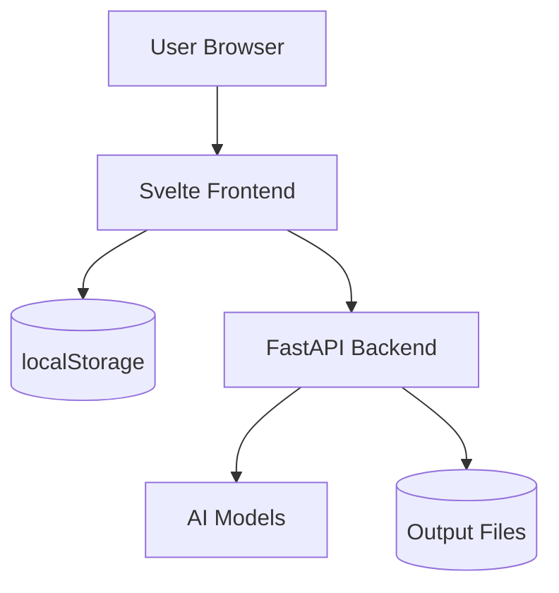
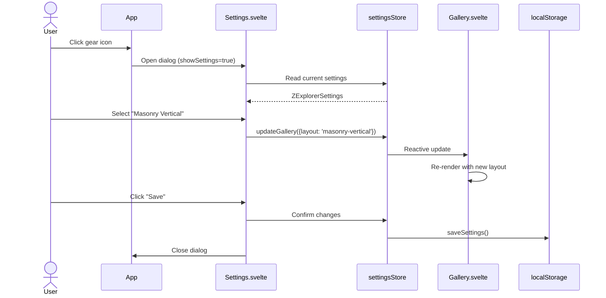
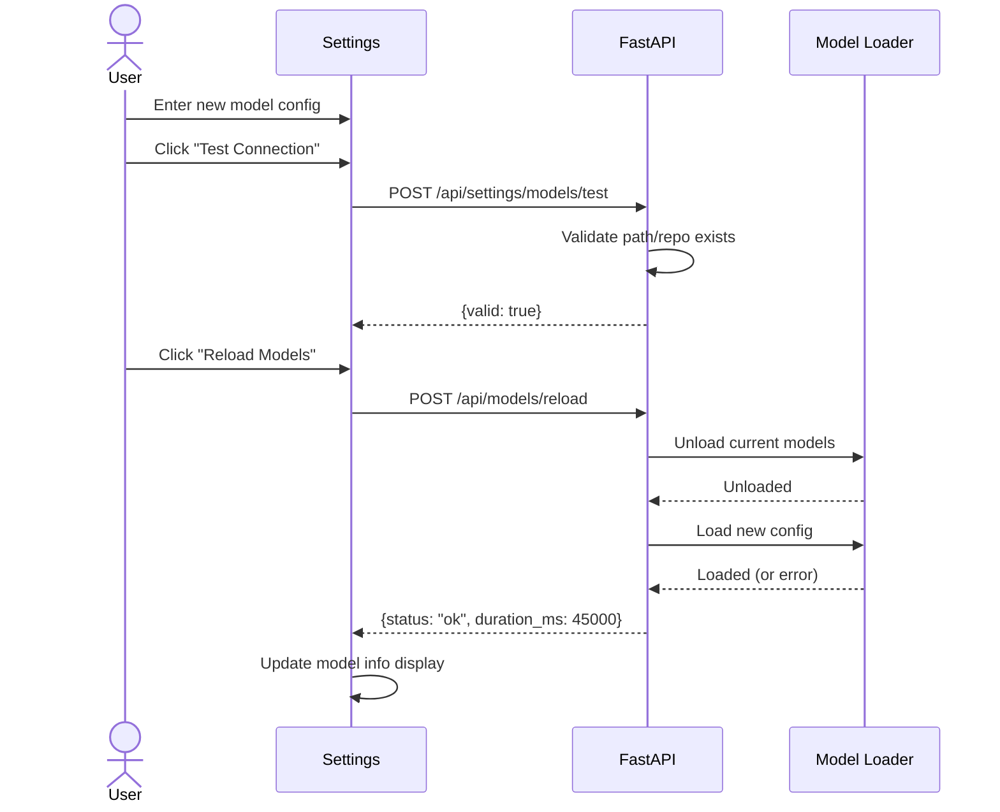

# Solution Design Document

## Validation Checklist

- [x] All required sections are complete
- [x] No [NEEDS CLARIFICATION] markers remain
- [x] All context sources are listed with relevance ratings
- [x] Project commands are discovered from actual project files
- [x] Constraints → Strategy → Design → Implementation path is logical
- [x] Architecture pattern is clearly stated with rationale
- [x] Every component in diagram has directory mapping
- [x] Every interface has specification
- [x] Error handling covers all error types
- [x] Quality requirements are specific and measurable
- [x] Every quality requirement has test coverage
- [x] **All architecture decisions confirmed by user**
- [x] Component names consistent across diagrams
- [x] A developer could implement from this design

---

## Constraints

CON-1 **Technology Stack**
- Frontend: Svelte 4.x, TypeScript, Vite build system
- Backend: Python 3.12+, FastAPI, uvicorn
- Browser Support: Modern browsers (Chrome 90+, Firefox 90+, Safari 14+, Edge 90+)
- No external frontend dependencies beyond existing (no React, Vue, etc.)

CON-2 **Development Standards**
- Frontend tests: Vitest + @testing-library/svelte (to be added)
- Backend tests: pytest with existing test structure
- Code style: Existing project conventions (TypeScript strict mode)
- Build: `npm run build` must produce working dist/

CON-3 **Runtime Constraints**
- Settings stored in browser localStorage (no backend persistence for UI prefs)
- Model configuration changes require backend API (runtime override, not .env modification)
- Single-user application (no auth, no multi-tenancy)

## Implementation Context

**IMPORTANT**: You MUST read and analyze ALL listed context sources to understand constraints, patterns, and existing architecture.

### Required Context Sources

- ICO-1 Frontend Application
```yaml
- file: src/z_explorer/gui/src/App.svelte
  relevance: HIGH
  why: "Main application component, handles state, generation, SSE connection"

- file: src/z_explorer/gui/src/lib/Gallery.svelte
  relevance: HIGH
  why: "Gallery component to be modified for layout options and thumbnail sizes"

- file: src/z_explorer/gui/src/lib/FakeCLI.svelte
  relevance: HIGH
  why: "CLI component, handles /settings command, tips section"

- file: src/z_explorer/gui/src/app.css
  relevance: MEDIUM
  why: "Design tokens and global styles to follow"

- file: src/z_explorer/gui/package.json
  relevance: HIGH
  why: "Dependencies and build scripts, test configuration to be added"

- file: src/z_explorer/gui/vite.config.ts
  relevance: MEDIUM
  why: "Vite configuration, test setup integration"
```

- ICO-2 Backend Server
```yaml
- file: src/z_explorer/server.py
  relevance: HIGH
  sections: ["/api/config endpoint", "model loading"]
  why: "API endpoints for model configuration"

- file: src/z_explorer/model_config.py
  relevance: HIGH
  why: "Model configuration loading and validation logic"
```

### Implementation Boundaries

- **Must Preserve**:
  - Existing Gallery layout (flex-row) as default option
  - CLI command structure and autocomplete
  - SSE generation progress flow
  - Current model loading from .env

- **Can Modify**:
  - Gallery.svelte (add layout options, thumbnail configuration)
  - FakeCLI.svelte (add /settings command, collapsible tips)
  - App.svelte (add settings state management, dialog trigger)
  - server.py (add model override endpoints)

- **Must Not Touch**:
  - Core image generation logic (image_generator.py)
  - LLM enhancement logic
  - Setup wizard flow (Setup.svelte)

### External Interfaces

#### System Context Diagram



#### Interface Specifications

```yaml
# Inbound Interfaces
inbound:
  - name: "Settings Dialog UI"
    type: User Interaction
    format: Svelte Component
    data_flow: "User preferences input"

  - name: "/settings CLI Command"
    type: CLI Command
    format: Text Input
    data_flow: "Opens settings dialog"

# Outbound Interfaces
outbound:
  - name: "localStorage"
    type: Browser Storage
    format: JSON
    key: "z-explorer-settings"
    data_flow: "Persist user preferences"

  - name: "Model Override API"
    type: HTTP REST
    format: JSON
    endpoints: ["/api/settings/models", "/api/models/reload"]
    data_flow: "Runtime model configuration"

# Data Interfaces
data:
  - name: "Browser localStorage"
    type: Key-Value Store
    connection: window.localStorage
    data_flow: "Settings persistence"
```

### Project Commands

```bash
# Component: Frontend (Svelte)
Location: src/z_explorer/gui/

## Environment Setup
Install Dependencies: npm install
Start Development: npm run dev

## Testing Commands (NEW - to be configured)
Unit Tests: npm run test
Component Tests: npm run test:components
E2E Tests: npm run test:e2e (via Playwright)
Test Coverage: npm run test:coverage

## Code Quality Commands
Type Checking: npm run check (svelte-check)
Build Project: npm run build

# Component: Backend (Python)
Location: src/z_explorer/

## Testing Commands
Unit Tests: uv run pytest tests/ -o addopts=""
Specific Tests: uv run pytest tests/test_server/ -v -o addopts=""

## Code Quality Commands
Type Checking: uv run mypy src/z_explorer/
```

## Solution Strategy

- **Architecture Pattern**: Component-based frontend with centralized state management via Svelte stores. Settings service acts as single source of truth for preferences.

- **Integration Approach**:
  - Settings component is a modal overlay, non-blocking
  - Settings changes propagate via Svelte reactive stores
  - Model overrides require explicit user action (Reload button)
  - Backend receives model config via new REST endpoints

- **Justification**:
  - Svelte stores provide reactive updates without external state library
  - localStorage is browser-standard, no backend changes for UI prefs
  - Modal pattern keeps context (user can see gallery behind settings)

- **Key Decisions**:
  - ADR-1: Svelte stores over Context API (simpler, built-in)
  - ADR-2: localStorage over IndexedDB (simpler for small data)
  - ADR-3: CSS-based layouts over JS layout libraries (performance)
  - ADR-4: Vitest over Jest (Vite-native, faster)

## Building Block View

### Components

```mermaid
graph LR
    User --> App[App.svelte]
    App --> Gallery[Gallery.svelte]
    App --> FakeCLI[FakeCLI.svelte]
    App --> Settings[Settings.svelte]

    Settings --> SettingsStore[settingsStore.ts]
    Gallery --> SettingsStore
    FakeCLI --> SettingsStore

    SettingsStore --> LocalStorage[(localStorage)]
    Settings --> ModelAPI[/api/settings/models]
    ModelAPI --> Backend[FastAPI]
```

### Directory Map

**Component**: Frontend
```
src/z_explorer/gui/src/
├── App.svelte                    # MODIFY: Add settings trigger, integrate store
├── app.css                       # MODIFY: Add settings dialog styles
├── lib/
│   ├── Gallery.svelte            # MODIFY: Multiple layouts, configurable thumbnails
│   ├── FakeCLI.svelte            # MODIFY: /settings command, collapsible tips
│   ├── Settings.svelte           # NEW: Settings dialog component
│   ├── stores/
│   │   └── settings.ts           # NEW: Svelte store for settings state
│   ├── services/
│   │   └── settingsService.ts    # NEW: localStorage read/write/validation
│   └── gallery/
│       ├── FlexRow.svelte        # NEW: Extract current layout
│       ├── MasonryVertical.svelte # NEW: Pinterest-style columns
│       ├── MasonryHorizontal.svelte # NEW: Horizontal lanes
│       ├── GridSquare.svelte     # NEW: Uniform squares
│       └── GridAuto.svelte       # NEW: CSS Grid auto-fit
├── __tests__/                    # NEW: Test directory
│   ├── setup.ts                  # NEW: Test setup file
│   ├── settingsService.test.ts   # NEW: Unit tests for service
│   ├── Settings.test.ts          # NEW: Component tests
│   └── Gallery.test.ts           # NEW: Gallery layout tests
├── vitest.config.ts              # NEW: Vitest configuration
└── package.json                  # MODIFY: Add test dependencies
```

**Component**: Backend
```
src/z_explorer/
├── server.py                     # MODIFY: Add model settings endpoints
├── model_config.py               # MODIFY: Add runtime override support
tests/
└── test_server/
    └── test_model_settings.py    # NEW: Tests for model override endpoints
```

### Interface Specifications

#### Data Storage Changes

```yaml
# Browser localStorage schema
Key: "z-explorer-settings"
Value: ZExplorerSettings (JSON)

Schema:
  gallery:
    layout: string  # 'flex-row' | 'masonry-vertical' | 'masonry-horizontal' | 'grid-square' | 'grid-auto'
    thumbnailSize: string  # 'small' | 'medium' | 'large' | 'xlarge' | 'custom'
    thumbnailHeight: number  # 80-500
    showPromptOnHover: boolean
    sortOrder: string  # 'newest' | 'oldest'
  cli:
    height: number  # 150-600
    showTipsOnStart: boolean
    fontSize: string  # 'small' | 'medium' | 'large'
  generation:
    defaultWidth: number
    defaultHeight: number
    defaultCount: number
    autoEnhance: boolean
  models:
    imageMode: string | null
    imageRepo: string | null
    imagePath: string | null
    llmMode: string | null
    llmRepo: string | null
    llmPath: string | null
```

#### Internal API Changes

```yaml
# New endpoint: Update model configuration
Endpoint: Update Model Settings
  Method: POST
  Path: /api/settings/models
  Request:
    image_mode: string | null  # 'hf_download' | 'hf_local' | 'sdnq' | 'components'
    image_repo: string | null
    image_path: string | null
    llm_mode: string | null  # 'hf_download' | 'hf_local' | 'gguf' | 'z_image'
    llm_repo: string | null
    llm_path: string | null
  Response:
    success:
      status: "ok"
      active_config: ModelConfigResponse
    error:
      status: "error"
      message: string
      field: string | null

# New endpoint: Validate model configuration
Endpoint: Test Model Connection
  Method: POST
  Path: /api/settings/models/test
  Request:
    model_type: string  # 'image' | 'llm'
    mode: string
    repo: string | null
    path: string | null
  Response:
    success:
      valid: true
      message: string
    error:
      valid: false
      message: string

# New endpoint: Reload models with current config
Endpoint: Reload Models
  Method: POST
  Path: /api/models/reload
  Request: {}  # Empty, uses current active config
  Response:
    success:
      status: "ok"
      duration_ms: number
      config: ModelConfigResponse
    error:
      status: "error"
      message: string
      rollback: boolean
```

#### Application Data Models

```typescript
// Settings interface (TypeScript)
interface ZExplorerSettings {
  gallery: GallerySettings;
  cli: CLISettings;
  generation: GenerationSettings;
  models: ModelSettings;
}

interface GallerySettings {
  layout: 'flex-row' | 'masonry-vertical' | 'masonry-horizontal' | 'grid-square' | 'grid-auto';
  thumbnailSize: 'small' | 'medium' | 'large' | 'xlarge' | 'custom';
  thumbnailHeight: number;
  showPromptOnHover: boolean;
  sortOrder: 'newest' | 'oldest';
}

interface CLISettings {
  height: number;
  showTipsOnStart: boolean;
  fontSize: 'small' | 'medium' | 'large';
}

interface GenerationSettings {
  defaultWidth: number;
  defaultHeight: number;
  defaultCount: number;
  autoEnhance: boolean;
}

interface ModelSettings {
  imageMode: string | null;
  imageRepo: string | null;
  imagePath: string | null;
  llmMode: string | null;
  llmRepo: string | null;
  llmPath: string | null;
}
```

```python
# Backend models (Python/Pydantic)
class ModelSettingsUpdate(BaseModel):
    image_mode: Optional[str] = None
    image_repo: Optional[str] = None
    image_path: Optional[str] = None
    llm_mode: Optional[str] = None
    llm_repo: Optional[str] = None
    llm_path: Optional[str] = None

class ModelTestRequest(BaseModel):
    model_type: Literal["image", "llm"]
    mode: str
    repo: Optional[str] = None
    path: Optional[str] = None

class ModelTestResponse(BaseModel):
    valid: bool
    message: str

class ModelReloadResponse(BaseModel):
    status: str
    duration_ms: Optional[int] = None
    config: Optional[ModelConfigResponse] = None
    message: Optional[str] = None
    rollback: Optional[bool] = None
```

### Implementation Examples

#### Example: Settings Store (Svelte)

**Why this example**: Demonstrates reactive state management pattern for settings

```typescript
// stores/settings.ts
import { writable, derived } from 'svelte/store';
import { loadSettings, saveSettings, DEFAULT_SETTINGS } from '../services/settingsService';

// Create writable store initialized from localStorage
function createSettingsStore() {
  const { subscribe, set, update } = writable<ZExplorerSettings>(loadSettings());

  return {
    subscribe,

    // Update a specific section
    updateGallery: (changes: Partial<GallerySettings>) => {
      update(settings => {
        const updated = { ...settings, gallery: { ...settings.gallery, ...changes } };
        saveSettings(updated);
        return updated;
      });
    },

    updateCLI: (changes: Partial<CLISettings>) => {
      update(settings => {
        const updated = { ...settings, cli: { ...settings.cli, ...changes } };
        saveSettings(updated);
        return updated;
      });
    },

    // Reset to defaults
    reset: () => {
      set(DEFAULT_SETTINGS);
      saveSettings(DEFAULT_SETTINGS);
    }
  };
}

export const settings = createSettingsStore();

// Derived store for thumbnail height in pixels
export const thumbnailHeightPx = derived(settings, ($settings) => {
  const presets = { small: 120, medium: 180, large: 250, xlarge: 350 };
  return $settings.gallery.thumbnailSize === 'custom'
    ? $settings.gallery.thumbnailHeight
    : presets[$settings.gallery.thumbnailSize];
});
```

#### Example: Settings Service (localStorage)

**Why this example**: Shows validation and persistence pattern

```typescript
// services/settingsService.ts
const SETTINGS_KEY = 'z-explorer-settings';

export const DEFAULT_SETTINGS: ZExplorerSettings = {
  gallery: {
    layout: 'flex-row',
    thumbnailSize: 'medium',
    thumbnailHeight: 180,
    showPromptOnHover: true,
    sortOrder: 'newest'
  },
  cli: {
    height: 420,
    showTipsOnStart: true,
    fontSize: 'medium'
  },
  generation: {
    defaultWidth: 1024,
    defaultHeight: 1024,
    defaultCount: 1,
    autoEnhance: false
  },
  models: {
    imageMode: null,
    imageRepo: null,
    imagePath: null,
    llmMode: null,
    llmRepo: null,
    llmPath: null
  }
};

export function loadSettings(): ZExplorerSettings {
  try {
    const stored = localStorage.getItem(SETTINGS_KEY);
    if (!stored) return DEFAULT_SETTINGS;

    const parsed = JSON.parse(stored);
    // Deep merge with defaults to handle missing fields from older versions
    return deepMerge(DEFAULT_SETTINGS, parsed);
  } catch (e) {
    console.warn('Failed to load settings, using defaults:', e);
    return DEFAULT_SETTINGS;
  }
}

export function saveSettings(settings: ZExplorerSettings): boolean {
  try {
    localStorage.setItem(SETTINGS_KEY, JSON.stringify(settings));
    return true;
  } catch (e) {
    console.error('Failed to save settings:', e);
    return false;
  }
}

export function validateThumbnailHeight(height: number): boolean {
  return height >= 80 && height <= 500;
}
```

#### Example: Gallery Layout Component

**Why this example**: Shows CSS-based masonry pattern

```svelte
<!-- gallery/MasonryVertical.svelte -->
<script lang="ts">
  import { thumbnailHeightPx } from '../stores/settings';

  export let images: ImageData[] = [];
  export let onSelect: (img: ImageData) => void;
</script>

<div class="masonry-vertical" style="--thumb-height: {$thumbnailHeightPx}px">
  {#each images as img, i}
    <button class="image-card" on:click={() => onSelect(img)}>
      
    </button>
  {/each}
</div>

<style>
  .masonry-vertical {
    columns: 3;
    column-gap: 8px;
  }

  .image-card {
    break-inside: avoid;
    margin-bottom: 8px;
    width: 100%;
    border: none;
    padding: 0;
    cursor: pointer;
    border-radius: var(--border-radius);
    overflow: hidden;
  }

  .image-card img {
    width: 100%;
    height: auto;
    display: block;
  }

  /* Responsive columns */
  @media (max-width: 1200px) { .masonry-vertical { columns: 2; } }
  @media (max-width: 800px) { .masonry-vertical { columns: 1; } }
</style>
```

## Runtime View

### Primary Flow

#### Primary Flow: Open Settings and Change Gallery Layout

1. User clicks gear icon in Gallery header OR types `/settings` in CLI
2. Settings dialog opens as modal overlay
3. User clicks "Gallery" tab (default)
4. User selects new layout from visual options
5. Gallery immediately re-renders with new layout (live preview)
6. User clicks "Save" to persist OR "Cancel" to discard
7. Dialog closes, settings saved to localStorage



#### Secondary Flow: Model Override

1. User opens Settings → Models tab
2. System displays current config (from .env or previous override)
3. User selects new image mode from dropdown
4. User enters repository name
5. User clicks "Test Connection"
6. System validates config via POST /api/settings/models/test
7. User clicks "Reload Models"
8. System calls POST /api/models/reload
9. Loading indicator shows during reload (30-60s)
10. Model info bar updates on success



### Error Handling

- **Invalid input (thumbnail size)**: Inline validation error, prevent save, highlight field
- **localStorage full/unavailable**: Toast notification "Settings will not persist", allow session-only usage
- **Model path not found**: Test Connection fails with "Path not found: /path/to/model"
- **Model load failure**: Show error message, rollback to previous config, display rollback notification
- **Network failure (model API)**: Disable model actions, show "Backend offline" warning

## Deployment View

No change to deployment. This feature is entirely frontend (localStorage) with optional backend endpoints.

### Single Application Deployment
- **Environment**: Browser (client-side) + Python backend
- **Configuration**: No new env vars required (overrides are runtime-only)
- **Dependencies**:
  - Frontend: New dev dependencies (vitest, @testing-library/svelte)
  - Backend: No new dependencies
- **Performance**:
  - Settings load: <10ms (localStorage read)
  - Gallery re-render: <100ms for 100 images
  - Model reload: 30-60s (existing performance)

## Cross-Cutting Concepts

### Pattern Documentation

```yaml
# Existing patterns used
- pattern: Svelte component structure
  relevance: HIGH
  why: "All new components follow existing Gallery.svelte pattern"

- pattern: CSS custom properties for theming
  relevance: HIGH
  why: "New styles use existing --accent-*, --bg-*, --text-* tokens"

# New patterns created
- pattern: Svelte store for settings (docs/patterns/settings-store.md)
  relevance: HIGH
  why: "Centralized reactive state management for preferences"

- pattern: Gallery layout abstraction (docs/patterns/gallery-layouts.md)
  relevance: MEDIUM
  why: "Each layout is a separate component with common interface"
```

### System-Wide Patterns

- **Security**: No sensitive data in settings; model paths validated server-side
- **Error Handling**: Try-catch around localStorage; fallback to defaults
- **Performance**: Lazy-load gallery layout components; debounce settings updates
- **Logging**: Console.warn for non-critical errors; console.error for failures

### Implementation Patterns

#### State Management Patterns
- Svelte writable stores for mutable state
- Derived stores for computed values (thumbnailHeightPx)
- Store subscription in components via $store syntax

#### Component Structure Pattern

```pseudocode
COMPONENT: SettingsDialog(props)
  INITIALIZE:
    localSettings = clone(storeSettings)  # Work on copy
    activeTab = 'gallery'

  HANDLE:
    onSave: commit localSettings to store
    onCancel: discard localSettings, close
    onReset: confirm, then reset store

  RENDER:
    Modal overlay with tabs
    Tab content based on activeTab
    Footer with Save/Cancel/Reset buttons
```

#### Error Handling Pattern

```pseudocode
FUNCTION: loadSettings()
  TRY:
    stored = localStorage.getItem(key)
    IF stored IS null: RETURN defaults
    parsed = JSON.parse(stored)
    RETURN deepMerge(defaults, parsed)
  CATCH (error):
    LOG warning with error details
    RETURN defaults  # Never fail, always return valid settings
```

#### Test Pattern

```pseudocode
TEST_SCENARIO: "Settings persist across page reload"
  SETUP:
    Clear localStorage
    Mount App component
  EXECUTE:
    Open settings dialog
    Change gallery layout to 'masonry-vertical'
    Click Save
    Unmount App
    Mount App again
  VERIFY:
    Gallery renders with masonry-vertical layout
    Settings store contains layout: 'masonry-vertical'
```

## Architecture Decisions

- [x] ADR-1 **Svelte stores over Context API**: Simpler API, built-in reactivity, no prop drilling
  - Rationale: Svelte stores are idiomatic and require less boilerplate
  - Trade-offs: Less familiar to React developers
  - User confirmed: Yes (Pyro approved design approach)

- [x] ADR-2 **localStorage over IndexedDB**: Synchronous API, simpler for small data
  - Rationale: Settings data is <10KB, localStorage is sufficient
  - Trade-offs: 5MB limit (not a concern), sync API blocks main thread (negligible for small data)
  - User confirmed: Yes

- [x] ADR-3 **CSS-based layouts over JS libraries (Masonry.js)**: Better performance, no dependencies
  - Rationale: CSS columns/grid handle layouts natively with GPU acceleration
  - Trade-offs: Less precise masonry packing than JS-based solutions
  - User confirmed: Yes

- [x] ADR-4 **Vitest over Jest**: Vite-native, faster cold starts, ESM support
  - Rationale: Project uses Vite; Vitest integrates seamlessly
  - Trade-offs: Newer tool, less community examples (but growing fast)
  - User confirmed: Yes (Pyro trusts judgment on Svelte tooling)

- [x] ADR-5 **Runtime model override over .env modification**: Safer, reversible
  - Rationale: Don't modify user's .env file; changes are session-scoped
  - Trade-offs: Must re-apply after server restart
  - User confirmed: Yes (PRD decision)

## Quality Requirements

- **Performance**:
  - Settings dialog open: <100ms
  - Layout change preview: <200ms for 50 images
  - Settings save: <50ms
  - Model reload: <90s (existing baseline is 30-60s)

- **Usability**:
  - Settings discoverable via icon AND command
  - Live preview for visual settings
  - Clear error messages with recovery guidance
  - Keyboard navigation (Tab, Enter, Escape)

- **Reliability**:
  - Settings load always succeeds (fallback to defaults)
  - Model reload has rollback on failure
  - No data loss on browser crash (settings already saved)

## Risks and Technical Debt

### Known Technical Issues
- Gallery currently has fixed 200px height - needs refactoring for configurable sizes
- Tips section is hardcoded in FakeCLI - needs extraction for collapsibility

### Technical Debt
- No existing frontend tests - test infrastructure must be added from scratch
- Gallery component does too much - layout logic should be extracted

### Implementation Gotchas
- Svelte reactivity requires assignment (`array = array` after push)
- localStorage is synchronous - don't call in hot paths
- CSS columns masonry doesn't preserve DOM order - may affect accessibility
- Model reload can leave GPU memory in inconsistent state if interrupted

## Test Specifications

### Critical Test Scenarios

**Scenario 1: Settings Persist Across Sessions**
```gherkin
Given: User has not customized settings before
And: localStorage is empty
When: User opens settings, changes layout to "masonry-vertical", saves
Then: Settings dialog closes
And: Gallery displays masonry-vertical layout
When: User refreshes the page
Then: Gallery still displays masonry-vertical layout
And: Settings dialog shows masonry-vertical selected
```

**Scenario 2: Invalid Thumbnail Size Rejected**
```gherkin
Given: Settings dialog is open on Gallery tab
When: User enters "50" in custom thumbnail height field
Then: Validation error appears: "Height must be between 80 and 500"
And: Save button is disabled
When: User corrects to "150"
Then: Validation error disappears
And: Save button is enabled
```

**Scenario 3: Model Test Connection Failure**
```gherkin
Given: Settings dialog is open on Models tab
When: User enters non-existent path "/fake/model/path"
And: User clicks "Test Connection"
Then: Loading indicator appears
And: Error message displays: "Path not found: /fake/model/path"
And: "Reload Models" button remains disabled
```

**Scenario 4: Model Reload Rollback on Failure**
```gherkin
Given: System is running with valid model config
And: User has entered invalid model settings
When: User clicks "Reload Models"
Then: Loading indicator shows "Reloading models..."
And: Backend attempts to load new config
And: Backend fails to load
Then: Backend rolls back to previous config
And: Error message: "Failed to load new config. Rolled back to previous."
And: Model info bar shows original config
```

### Test Coverage Requirements

- **Unit Tests (settingsService.ts)**:
  - loadSettings returns defaults when localStorage empty
  - loadSettings merges partial stored data with defaults
  - saveSettings writes to localStorage
  - validateThumbnailHeight accepts 80-500, rejects outside range

- **Component Tests (Settings.svelte)**:
  - Dialog opens on trigger
  - Tab navigation works
  - Form inputs update local state
  - Save commits to store
  - Cancel discards changes
  - Reset restores defaults with confirmation

- **Component Tests (Gallery layouts)**:
  - Each layout renders correct number of images
  - Thumbnail size applies correctly
  - Layout responds to settings changes

- **Integration Tests**:
  - Settings changes propagate to Gallery
  - /settings command opens dialog
  - Model test connection calls API

- **E2E Tests (Playwright)**:
  - Full settings workflow: open, change, save, verify persistence
  - Model override workflow: configure, test, reload

---

## Glossary

### Domain Terms

| Term | Definition | Context |
|------|------------|---------|
| Gallery Layout | Visual arrangement pattern for image thumbnails | User-configurable display preference |
| Masonry | Layout where items stack like bricks, varying sizes | Pinterest-style image display |
| Thumbnail | Smaller preview version of generated image | Gallery display element |
| Model Override | Runtime configuration that supersedes .env settings | Temporary model switching |

### Technical Terms

| Term | Definition | Context |
|------|------------|---------|
| Svelte Store | Reactive state container with subscribe pattern | Settings state management |
| localStorage | Browser-based key-value storage API | Settings persistence |
| SSE | Server-Sent Events for real-time updates | Generation progress streaming |
| Vitest | Vite-native test runner | Frontend testing |

### API/Interface Terms

| Term | Definition | Context |
|------|------------|---------|
| LoadingMode | Enum: hf_download, hf_local, sdnq, components | Image model source type |
| LLMMode | Enum: hf_download, hf_local, gguf, z_image | LLM model source type |
