# Solution Design Document

## Validation Checklist

- [x] All required sections are complete
- [x] No [NEEDS CLARIFICATION] markers remain
- [x] All context sources are listed with relevance ratings
- [x] Project commands are discovered from actual project files
- [x] Constraints → Strategy → Design → Implementation path is logical
- [x] Architecture pattern is clearly stated with rationale
- [x] Every component in diagram has directory mapping
- [x] Every interface has specification
- [x] Error handling covers all error types
- [x] Quality requirements are specific and measurable
- [x] Every quality requirement has test coverage
- [x] **All architecture decisions confirmed by user**
- [x] Component names consistent across diagrams
- [x] A developer could implement from this design

---

## Constraints

CON-1 **Framework Requirements**: Must use existing Svelte 4 + FastAPI stack. No new frontend frameworks.

CON-2 **Performance Targets**: Panel open animation must complete in <300ms. Metadata loading must not block gallery display.

CON-3 **Backward Compatibility**: Existing images without sidecar files must still display. No breaking changes to current API responses.

CON-4 **File System**: Sidecar files must be created atomically to avoid corruption. Must handle read-only output directories gracefully.

## Implementation Context

### Required Context Sources

```yaml
# Internal documentation and patterns
- doc: docs/specs/concepts/info-flyout/DESIGN.md
  relevance: HIGH
  why: "Contains mockups, UI specs, and interaction design already approved"

- doc: docs/specs/concepts/info-flyout/mockup-info-overlay.html
  relevance: HIGH
  why: "Visual reference for info panel implementation"

# Source code files that must be understood
- file: src/z_explorer/gui/src/App.svelte
  relevance: HIGH
  sections: [ImageData interface, selectedImage state, preview-overlay]
  why: "Current lightbox implementation to be extended"

- file: src/z_explorer/core/generator.py
  relevance: HIGH
  sections: [_emit function, image_saved event]
  why: "Where metadata is available and events are emitted"

- file: src/z_explorer/core/types.py
  relevance: HIGH
  sections: [ProgressEvent, GenerationResult]
  why: "Existing type definitions to extend"

- file: src/z_explorer/server.py
  relevance: HIGH
  sections: [ImageInfo model, list_images endpoint, SSE handler]
  why: "API models and endpoints to extend"
```

### Implementation Boundaries

- **Must Preserve**: 
  - Current gallery thumbnail behavior
  - SSE streaming for generation progress
  - Existing `/api/images` response structure (additive changes only)
  - Lightbox open/close behavior
  
- **Can Modify**: 
  - `ImageData` interface (extend with new fields)
  - `ImageInfo` model (extend with new fields)
  - Lightbox content area (add info button and panel)
  - `image_saved` event data (extend with metadata)
  
- **Must Not Touch**: 
  - Image generation logic in `image_generator.py`
  - Variable substitution logic
  - Setup wizard

### External Interfaces

#### System Context Diagram


#### Interface Specifications

```yaml
# Inbound Interfaces
inbound:
  - name: "Web GUI"
    type: HTTP/HTTPS
    format: REST + SSE
    authentication: None (local app)
    data_flow: "User interactions, image requests"

# Data Interfaces
data:
  - name: "Output Directory"
    type: Local Filesystem
    connection: Direct file I/O
    data_flow: "PNG images + JSON metadata sidecars"
```

### Project Commands

```bash
# Backend (Python)
Location: .

## Environment Setup
Install Dependencies: uv sync
Environment Variables: see env.example
Start Development: uv run z-explorer

# Testing Commands
Unit Tests: uv run pytest
Test with Coverage: uv run pytest --cov
Specific Test: uv run pytest tests/test_server/test_endpoints.py -v

# Code Quality
Linting: uv run ruff check .
Formatting: uv run ruff format .

# Frontend (Svelte)
Location: src/z_explorer/gui/

## Environment Setup
Install Dependencies: npm install

# Development
Start Dev Server: npm run dev
Build Production: npm run build

# Testing
Type Check: npm run check
Unit Tests: npm run test
Watch Mode: npm run test:watch
```

## Solution Strategy

- **Architecture Pattern**: Extension of existing component-based architecture. New Svelte components for info button and panel. Backend changes are additive (new fields, new sidecar files).

- **Integration Approach**: 
  - Frontend: New components inserted into existing lightbox in App.svelte
  - Backend: Generator emits extended metadata, server reads/writes sidecar files
  - Data flow: Generation → Sidecar file → API → Frontend → Panel display

- **Justification**: Minimal invasive changes to working system. Sidecar files chosen over embedded metadata (PNG chunks) for simplicity and human-readability.

- **Key Decisions**:
  1. JSON sidecar files for metadata persistence (not PNG metadata)
  2. Slide-in panel from right (not modal, not bottom drawer)
  3. Lazy loading of metadata (load on panel open, not on gallery load)

## Building Block View

### Components


### Directory Map

**Frontend Components**:
```
src/z_explorer/gui/src/
├── App.svelte                    # MODIFY: Add InfoButton, InfoPanel to lightbox
├── lib/
│   ├── InfoButton.svelte         # NEW: ⓘ button overlay component
│   ├── InfoPanel.svelte          # NEW: Slide-in metadata panel
│   └── stores/
│       └── settings.ts           # NO CHANGE
```

**Backend Modules**:
```
src/z_explorer/
├── core/
│   ├── generator.py              # MODIFY: Emit extended metadata in image_saved
│   ├── types.py                  # MODIFY: Add ImageMetadata model
│   └── metadata.py               # NEW: Sidecar file read/write utilities
├── server.py                     # MODIFY: Extend ImageInfo, add metadata endpoint
```

**Output Directory**:
```
output/
├── z_image_20251202_091338_543769263.png
├── z_image_20251202_091338_543769263.json   # NEW: Sidecar metadata
```

### Interface Specifications

#### Data Storage Changes

```yaml
# New sidecar file format
File: {image_name}.json (alongside .png)
  original_prompt: string        # Template with variables
  final_prompt: string           # After substitution/enhancement
  seed: integer                  # Random seed used
  width: integer                 # Image width in pixels
  height: integer                # Image height in pixels
  created_at: string             # ISO 8601 timestamp
  enhanced: boolean              # Whether > operator was used
  model: string (optional)       # Image model used (sdnq, hf, etc.)
```

#### Internal API Changes

```yaml
# Extended ImageInfo model (server.py)
Endpoint: GET /api/images
Response (extended):
  images[]:
    path: string
    name: string
    url: string
    modified: float
    prompt: string (optional)           # EXISTING: final prompt
    original_prompt: string (optional)  # NEW
    seed: integer (optional)            # NEW
    width: integer (optional)           # NEW
    height: integer (optional)          # NEW
    created_at: string (optional)       # NEW
    enhanced: boolean (optional)        # NEW

# New endpoint for single image metadata
Endpoint: GET /api/images/{filename}/metadata
Response:
  success: boolean
  metadata:
    original_prompt: string
    final_prompt: string
    seed: integer
    width: integer
    height: integer
    created_at: string
    enhanced: boolean
  error: string (if success=false)
```

#### Application Data Models

```typescript
// Frontend: Extended ImageData interface (App.svelte)
interface ImageData {
  url: string;
  prompt?: string;              // EXISTING: kept for backward compat
  originalPrompt?: string;      // NEW
  finalPrompt?: string;         // NEW
  seed?: number;                // NEW
  width?: number;               // NEW
  height?: number;              // NEW
  createdAt?: string;           // NEW
  enhanced?: boolean;           // NEW
  fileSize?: number;            // NEW (computed client-side if needed)
}
```

```python
# Backend: New ImageMetadata model (core/types.py)
class ImageMetadata(BaseModel):
    """Metadata stored alongside generated images."""
    original_prompt: str
    final_prompt: str
    seed: int
    width: int
    height: int
    created_at: str  # ISO 8601
    enhanced: bool = False
    model: Optional[str] = None
```

## Runtime View

### Primary Flow: View Image Metadata

1. User clicks image thumbnail in gallery
2. Lightbox opens with image (existing behavior)
3. User sees `ⓘ` button in bottom-right corner
4. User clicks `ⓘ` button (or presses `i` key)
5. InfoPanel slides in from right
6. Panel displays all available metadata
7. User can copy prompts or close panel

```mermaid
sequenceDiagram
    actor User
    participant LB as Lightbox
    participant IB as InfoButton
    participant IP as InfoPanel
    participant App as App.svelte
    
    User->>LB: Click image
    LB->>App: selectedImage = imageData
    App->>LB: Render with InfoButton
    User->>IB: Click ⓘ
    IB->>App: showInfoPanel = true
    App->>IP: Render with imageData
    IP->>User: Display metadata
    User->>IP: Click Copy Original
    IP->>User: Clipboard + toast feedback
    User->>IP: Click × or press Esc
    IP->>App: showInfoPanel = false
```



### Secondary Flow: Generate Image with Metadata

1. User submits prompt in CLI
2. Generator processes prompt (variables, enhancement)
3. Image is generated and saved
4. Metadata is collected (original prompt, final prompt, seed, dimensions)
5. Sidecar JSON file is written alongside image
6. SSE event includes extended metadata
7. Frontend receives metadata with image


### Error Handling

| Error Type | Handling |
|------------|----------|
| Sidecar file missing | Show "Metadata not available" in panel, display image normally |
| Sidecar file corrupted | Log warning, show partial data or "Unable to load metadata" |
| Write permission denied | Log error, continue without sidecar (image still saves) |
| Panel animation jank | Use CSS transforms with `will-change`, GPU acceleration |
| Copy to clipboard fails | Show error toast "Copy failed - please copy manually" |

## Deployment View

**No change to deployment.** Feature is purely additive:
- New Svelte components bundled with existing build
- New Python module imported by existing server
- Sidecar files created in existing output directory

## Cross-Cutting Concepts

### Pattern Documentation

```yaml
# Existing patterns used
- pattern: SSE streaming for progress events
  relevance: HIGH
  why: "Metadata flows through existing SSE infrastructure"

- pattern: Svelte stores for state management  
  relevance: MEDIUM
  why: "Panel visibility state follows existing patterns"

# New patterns created
- pattern: Sidecar metadata files
  relevance: HIGH
  why: "New pattern for persisting generation metadata"
```

### Component Structure Pattern

```svelte
<!-- InfoPanel.svelte structure -->
<script lang="ts">
  export let imageData: ImageData;
  export let visible: boolean = false;
  export let onClose: () => void;
  
  function copyToClipboard(text: string, label: string) {
    navigator.clipboard.writeText(text);
    // Show toast feedback
  }
</script>

{#if visible}
  <div class="info-panel" transition:fly={{ x: 320, duration: 300 }}>
    <header>
      <h3>Image Info</h3>
      <button on:click={onClose}>×</button>
    </header>
    
    <section class="prompts">
      {#if imageData.originalPrompt}
        <div class="field">
          <label>Original Prompt</label>
          <p>{imageData.originalPrompt}</p>
          <button on:click={() => copyToClipboard(imageData.originalPrompt, 'Original')}>
            📋 Copy
          </button>
        </div>
      {/if}
      <!-- Similar for finalPrompt -->
    </section>
    
    <section class="metadata-grid">
      <!-- Size, Seed, Date, etc. -->
    </section>
  </div>
{/if}
```

### Metadata Utility Pattern

```python
# core/metadata.py
from pathlib import Path
from typing import Optional
import json
from datetime import datetime, timezone

from z_explorer.core.types import ImageMetadata


def get_sidecar_path(image_path: Path) -> Path:
    """Get the sidecar JSON path for an image."""
    return image_path.with_suffix(".json")


def save_metadata(image_path: Path, metadata: ImageMetadata) -> bool:
    """Save metadata to sidecar file. Returns True on success."""
    sidecar_path = get_sidecar_path(image_path)
    try:
        # Atomic write: write to temp, then rename
        temp_path = sidecar_path.with_suffix(".json.tmp")
        temp_path.write_text(metadata.model_dump_json(indent=2))
        temp_path.rename(sidecar_path)
        return True
    except Exception as e:
        logger.warning(f"Failed to save metadata: {e}")
        return False


def load_metadata(image_path: Path) -> Optional[ImageMetadata]:
    """Load metadata from sidecar file. Returns None if unavailable."""
    sidecar_path = get_sidecar_path(image_path)
    if not sidecar_path.exists():
        return None
    try:
        data = json.loads(sidecar_path.read_text())
        return ImageMetadata(**data)
    except Exception as e:
        logger.warning(f"Failed to load metadata: {e}")
        return None
```

## Architecture Decisions

- [x] **ADR-1: JSON Sidecar Files for Metadata**
  - Choice: Store metadata in `.json` files alongside images
  - Alternatives considered: PNG metadata chunks, SQLite database, in-memory only
  - Rationale: Human-readable, easy to backup, no external dependencies, survives app restarts
  - Trade-offs: Extra files in output directory, slight disk overhead
  - User confirmed: ✅

- [x] **ADR-2: Slide-in Panel from Right**
  - Choice: Panel slides in from right edge, 320px fixed width
  - Alternatives considered: Modal overlay, bottom drawer, tooltip/popover
  - Rationale: Doesn't cover image, matches mockup design, works for all image aspect ratios
  - Trade-offs: Reduces visible image width when open
  - User confirmed: ✅

- [x] **ADR-3: Lazy Metadata Loading**
  - Choice: Load full metadata when panel opens, not on gallery load
  - Alternatives considered: Eager load all metadata, embed in gallery response
  - Rationale: Faster gallery load, metadata often not needed
  - Trade-offs: Slight delay when opening panel (negligible with local files)
  - User confirmed: ✅

- [x] **ADR-4: Additive API Changes Only**
  - Choice: Extend existing models with optional fields, don't change existing fields
  - Alternatives considered: New API version, breaking changes
  - Rationale: Backward compatibility, no frontend/backend version coupling
  - Trade-offs: Some field duplication (`prompt` vs `finalPrompt`)
  - User confirmed: ✅

## Quality Requirements

| Requirement | Target | Measurement |
|-------------|--------|-------------|
| Panel open animation | <300ms | CSS transition duration |
| Metadata load time | <50ms | Time from panel open to data display (local files) |
| Sidecar write success | >99% | Monitor write failures in logs |
| Copy to clipboard | 100% success on modern browsers | Test across Chrome, Firefox, Edge |
| Graceful degradation | 100% | Images without sidecars display without errors |

## Risks and Technical Debt

### Known Technical Issues

- Current `image_saved` event only includes `path`, `seed`, `prompt` (final) — needs extension
- `ImageInfo` model doesn't include all metadata fields — needs extension
- No `.txt` to `.json` migration for existing prompts — accepted as limitation

### Implementation Gotchas

- **Atomic writes**: Must use temp file + rename to avoid corrupted sidecars on crash
- **Clipboard API**: Requires HTTPS or localhost, may fail on some browsers — need fallback UI
- **Svelte transitions**: Use `fly` transition for panel, not custom CSS for consistency
- **Event ordering**: `image_saved` must fire AFTER sidecar is written

## Test Specifications

### Critical Test Scenarios

**Scenario 1: Metadata Saved with Image**
```gherkin
Given: User submits prompt "a __animal__ in forest > enhance"
When: Image generation completes
Then: PNG file exists in output directory
And: JSON sidecar file exists with same base name
And: Sidecar contains original_prompt, final_prompt, seed, dimensions
```

**Scenario 2: Panel Displays Metadata**
```gherkin
Given: Image exists with valid sidecar file
When: User opens lightbox and clicks ⓘ button
Then: Panel slides in from right
And: Original prompt is displayed
And: Final prompt is displayed
And: Seed, dimensions, date are displayed
```

**Scenario 3: Graceful Degradation**
```gherkin
Given: Image exists without sidecar file
When: User opens lightbox and clicks ⓘ button
Then: Panel slides in
And: "Metadata not available" message is shown
And: No errors in console
```

**Scenario 4: Copy Prompt**
```gherkin
Given: Panel is open with metadata displayed
When: User clicks "Copy Original" button
Then: Original prompt is copied to clipboard
And: Visual feedback confirms copy
```

### Test Coverage Requirements

- **Backend**:
  - `test_metadata_save_load()` — round-trip sidecar write/read
  - `test_metadata_missing_graceful()` — load returns None for missing file
  - `test_metadata_corrupted_graceful()` — load returns None for invalid JSON
  - `test_image_saved_event_includes_metadata()` — SSE event has all fields

- **Frontend**:
  - `test_info_button_renders()` — button visible in lightbox
  - `test_panel_opens_on_click()` — click triggers panel
  - `test_panel_opens_on_keyboard()` — 'i' key triggers panel
  - `test_panel_closes_on_escape()` — Escape dismisses panel
  - `test_copy_button_works()` — clipboard API integration

---

## Glossary

### Domain Terms

| Term | Definition | Context |
|------|------------|---------|
| Original Prompt | The template prompt as typed by user, with `__variables__` and `>` operators | Displayed in panel, used for regeneration |
| Final Prompt | The prompt after variable substitution and LLM enhancement | What actually generated the image |
| Sidecar File | A companion file (JSON) stored alongside an image containing metadata | Enables metadata persistence |

### Technical Terms

| Term | Definition | Context |
|------|------------|---------|
| SSE | Server-Sent Events — one-way server-to-client streaming | Used for generation progress |
| Lightbox | Full-screen image preview overlay | Where info button and panel are added |
| Flyout/Panel | Slide-in UI element from edge of screen | The metadata display component |
