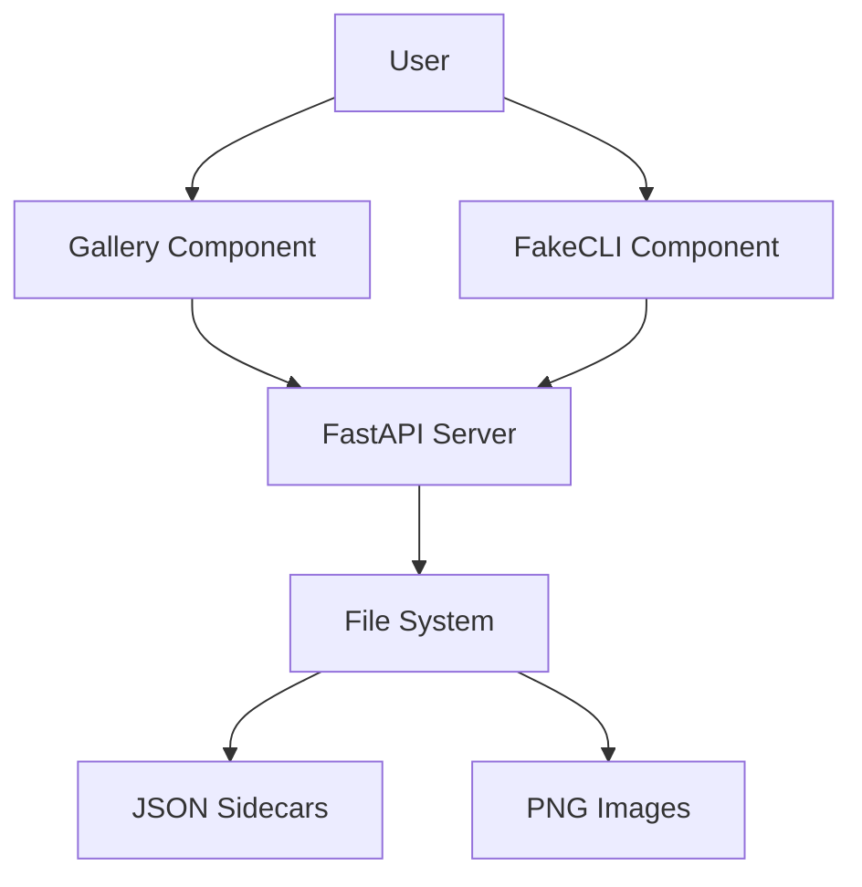
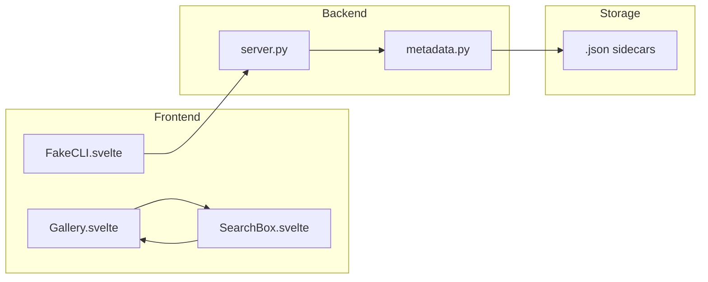
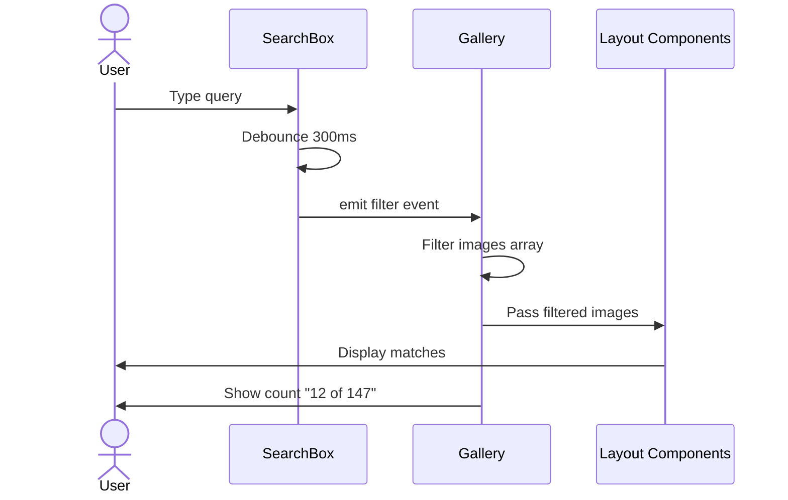
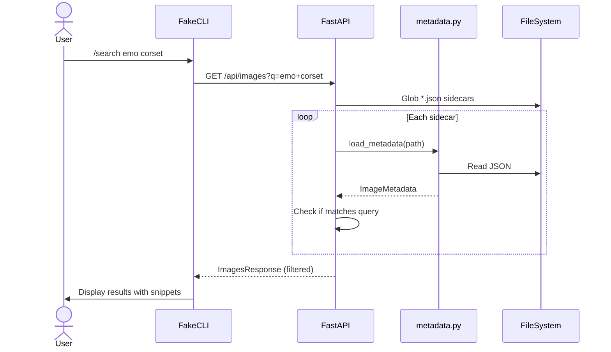

# Solution Design Document

## Validation Checklist

- [x] All required sections are complete
- [x] No [NEEDS CLARIFICATION] markers remain
- [x] All context sources are listed with relevance ratings
- [x] Project commands are discovered from actual project files
- [x] Constraints → Strategy → Design → Implementation path is logical
- [x] Architecture pattern is clearly stated with rationale
- [x] Every component in diagram has directory mapping
- [x] Every interface has specification
- [x] Error handling covers all error types
- [x] Quality requirements are specific and measurable
- [x] Every quality requirement has test coverage
- [x] **All architecture decisions confirmed by user**
- [x] Component names consistent across diagrams
- [x] A developer could implement from this design

---

## Constraints

CON-1 **Dependency on Spec 002**: Search relies on metadata sidecar files (`.json`) created by spec 002. Images without sidecars cannot be searched but must remain visible.

CON-2 **Client-side Performance**: Search must remain responsive (<100ms filter time) with 1000+ images. Gallery rendering must not block during search.

CON-3 **Framework Requirements**: Must use existing Svelte 4 + FastAPI stack. No new frontend frameworks or search libraries.

CON-4 **Local-only**: No external search APIs or cloud indexing. All search runs locally against filesystem.

## Implementation Context

### Required Context Sources

```yaml
# Specification dependencies
- doc: docs/specs/002-info-flyout-metadata/solution-design.md
  relevance: HIGH
  why: "Search depends on metadata sidecar files defined in spec 002"

- doc: docs/specs/concepts/info-flyout/DESIGN.md
  relevance: HIGH
  sections: [Part 2: Gallery Search]
  why: "Original design notes for search feature"

# Source code files that must be understood
- file: src/z_explorer/gui/src/lib/Gallery.svelte
  relevance: HIGH
  sections: [gallery-header, gallery-content, images prop]
  why: "Search box will be added to gallery header"

- file: src/z_explorer/gui/src/lib/FakeCLI.svelte
  relevance: HIGH
  sections: [handleCommand, commands array]
  why: "/search command will be added here"

- file: src/z_explorer/server.py
  relevance: HIGH
  sections: [ImageInfo model, list_images endpoint, lines 1007-1070]
  why: "Search endpoint extends existing image listing"

- file: src/z_explorer/core/metadata.py
  relevance: HIGH
  why: "Search uses load_metadata() from spec 002"
```

### Implementation Boundaries

- **Must Preserve**: 
  - Current gallery thumbnail behavior and layouts
  - Existing `/api/images` response structure (additive only)
  - FakeCLI command parsing patterns
  - Gallery empty state and generating state displays
  
- **Can Modify**: 
  - `Gallery.svelte` header (add search input)
  - `FakeCLI.svelte` commands array and handleCommand
  - `ImageInfo` model (extend with search-related fields)
  - `/api/images` endpoint (add optional query parameter)
  
- **Must Not Touch**: 
  - Gallery layout components (FlexRow, Masonry*, Grid*)
  - Image generation logic
  - Settings and setup flows

### External Interfaces

#### System Context Diagram



### Project Commands

```bash
# Backend (Python)
Location: .

## Testing Commands
Unit Tests: uv run pytest
Test with Coverage: uv run pytest --cov
Specific Test: uv run pytest tests/test_server/test_endpoints.py -v

## Code Quality
Linting: uv run ruff check .
Formatting: uv run ruff format .

# Frontend (Svelte)
Location: src/z_explorer/gui/

## Development
Start Dev Server: npm run dev
Build Production: npm run build

## Testing
Type Check: npm run check
Unit Tests: npm run test
Watch Mode: npm run test:watch
```

## Solution Strategy

- **Architecture Pattern**: Extension of existing component-based architecture. Search is implemented as a filter layer, not a separate data path. Backend provides optional filtering; frontend can filter client-side for instant feedback.

- **Integration Approach**: 
  - Gallery: Add search input to header, filter `images` array before passing to layout components
  - CLI: Add `/search` command that calls backend API and displays results inline
  - Backend: Extend `/api/images` with optional `q` parameter for server-side search

- **Justification**: Dual search approach (client-side for UI responsiveness, server-side for CLI) maximizes user experience. Simple substring matching is sufficient for v1.

- **Key Decisions**:
  1. Client-side filtering for gallery (instant feedback)
  2. Server-side search endpoint for CLI (structured response)
  3. AND logic for multiple search terms
  4. Case-insensitive matching

## Building Block View

### Components



### Directory Map

**Frontend Components**:
```
src/z_explorer/gui/src/
├── lib/
│   ├── Gallery.svelte            # MODIFY: Add SearchBox, filter logic
│   ├── SearchBox.svelte          # NEW: Search input component
│   ├── FakeCLI.svelte            # MODIFY: Add /search command
│   └── gallery/
│       └── [layouts unchanged]
```

**Backend Modules**:
```
src/z_explorer/
├── server.py                     # MODIFY: Add search to /api/images
├── core/
│   └── metadata.py               # USE: load_metadata() from spec 002
```

### Interface Specifications

#### Internal API Changes

```yaml
# Extended /api/images endpoint
Endpoint: List and Search Images
  Method: GET
  Path: /api/images
  Query Parameters:
    q: string (optional) - Search query
  Response (unchanged structure, filtered results):
    images[]:
      path: string
      name: string
      url: string
      modified: float
      prompt: string (optional)           # EXISTING
      original_prompt: string (optional)  # FROM SPEC 002
      final_prompt: string (optional)     # FROM SPEC 002
      match_field: string (optional)      # NEW: "original" | "final" | null
      snippet: string (optional)          # NEW: matched text snippet
    count: integer
    query: string (optional)              # NEW: echo of search query

# Search-specific response fields (only when q is provided)
When searching:
  - match_field: Which field contained the match
  - snippet: ~60 char context around match with "..." truncation
  - count: Number of matching images (not total)
```

#### Application Data Models

```typescript
// Frontend: Extended ImageData interface
interface ImageData {
  url: string;
  prompt?: string;              // EXISTING
  originalPrompt?: string;      // FROM SPEC 002
  finalPrompt?: string;         // FROM SPEC 002
  // Search result fields (optional, only from search API)
  matchField?: 'original' | 'final';
  snippet?: string;
}

// Search state in Gallery
interface SearchState {
  query: string;
  isSearching: boolean;
  resultCount: number;
  totalCount: number;
}
```

```python
# Backend: Extended ImageInfo model
class ImageInfo(BaseModel):
    """Information about a generated image."""
    path: str
    name: str
    url: str
    modified: float
    prompt: Optional[str] = None
    # From spec 002
    original_prompt: Optional[str] = None
    final_prompt: Optional[str] = None
    # Search result fields
    match_field: Optional[Literal["original", "final"]] = None
    snippet: Optional[str] = None

class ImagesResponse(BaseModel):
    """Response model for images listing."""
    images: list[ImageInfo]
    count: int
    query: Optional[str] = None  # NEW: echo search query
```

## Runtime View

### Primary Flow: Gallery Search

1. User types in search box
2. After 300ms debounce, filter `images` array
3. Matching images displayed, count updated
4. User clicks image to open lightbox (normal flow)



### Secondary Flow: CLI Search

1. User types `/search emo corset` in CLI
2. CLI calls `/api/images?q=emo+corset`
3. Server filters images by query
4. Results displayed inline with snippets



### Error Handling

| Error Type | Handling |
|------------|----------|
| Empty query | Show all images (no filter) |
| No matches | Show "No images found for '{query}'" message |
| Query too short (<2 chars) | Show hint, don't filter |
| Special characters | Treat literally, no regex interpretation |
| Sidecar missing | Image excluded from search results but shown in unfiltered view |
| Sidecar corrupted | Log warning, exclude from search, show in unfiltered |

### Search Algorithm

```python
def matches_query(metadata: ImageMetadata, query: str) -> tuple[bool, str, str]:
    """
    Check if metadata matches search query.
    Returns (matches, match_field, snippet).
    """
    query_lower = query.lower()
    terms = query_lower.split()  # Split into words
    
    original = (metadata.original_prompt or "").lower()
    final = (metadata.final_prompt or "").lower()
    
    # AND logic: all terms must be present
    original_matches = all(term in original for term in terms)
    final_matches = all(term in final for term in terms)
    
    if original_matches:
        snippet = create_snippet(metadata.original_prompt, terms[0])
        return True, "original", snippet
    elif final_matches:
        snippet = create_snippet(metadata.final_prompt, terms[0])
        return True, "final", snippet
    
    return False, None, None

def create_snippet(text: str, term: str, context: int = 30) -> str:
    """Create ~60 char snippet centered on first match."""
    idx = text.lower().find(term.lower())
    if idx == -1:
        return text[:60] + "..."
    
    start = max(0, idx - context)
    end = min(len(text), idx + len(term) + context)
    
    snippet = text[start:end]
    if start > 0:
        snippet = "..." + snippet
    if end < len(text):
        snippet = snippet + "..."
    
    return snippet
```

## Deployment View

**No change to deployment.** Feature is purely additive:
- New Svelte component bundled with existing build
- Backend changes extend existing endpoint
- No new services or infrastructure

## Cross-Cutting Concepts

### Pattern Documentation

```yaml
# Existing patterns used
- pattern: Svelte event dispatch for parent-child communication
  relevance: HIGH
  why: "SearchBox dispatches filter events to Gallery"

- pattern: Debounced input handling
  relevance: HIGH
  why: "Prevent excessive filtering on every keystroke"

# New patterns created
- pattern: Client-side filtering with server fallback
  relevance: MEDIUM
  why: "Gallery filters client-side; CLI uses server-side for structured response"
```

### Component Structure Pattern

```svelte
<!-- SearchBox.svelte structure -->
<script lang="ts">
  import { createEventDispatcher } from 'svelte';
  
  export let totalCount: number = 0;
  export let resultCount: number = 0;
  export let isActive: boolean = false;
  
  let query = '';
  let debounceTimer: ReturnType<typeof setTimeout>;
  
  const dispatch = createEventDispatcher<{
    filter: { query: string };
    clear: void;
  }>();
  
  function handleInput() {
    clearTimeout(debounceTimer);
    debounceTimer = setTimeout(() => {
      dispatch('filter', { query: query.trim() });
    }, 300);
  }
  
  function handleKeydown(e: KeyboardEvent) {
    if (e.key === 'Escape') {
      query = '';
      dispatch('clear');
    }
  }
</script>

<div class="search-box" class:active={isActive}>
  <span class="search-icon">🔍</span>
  <input
    type="text"
    bind:value={query}
    on:input={handleInput}
    on:keydown={handleKeydown}
    placeholder="Search prompts..."
  />
  {#if isActive}
    <span class="result-count">{resultCount} of {totalCount}</span>
  {/if}
</div>
```

### CLI Command Pattern

```typescript
// In FakeCLI.svelte handleCommand
case '/search':
  if (args.length === 0) {
    history = [...history,
      { type: 'dim', text: 'Usage: /search <keywords>' },
      { type: 'dim', text: 'Example: /search emo corset' }
    ];
    break;
  }
  
  const searchQuery = args.join(' ');
  history = [...history, { type: 'cyan', text: `🔍 Searching for "${searchQuery}"...` }];
  scrollToBottom();
  
  fetch(`${API_BASE}/api/images?q=${encodeURIComponent(searchQuery)}`)
    .then(res => res.json())
    .then(data => {
      if (data.count === 0) {
        history = [...history, { type: 'dim', text: `No images found matching "${searchQuery}"` }];
      } else {
        history = [...history,
          { type: 'success', text: `🔍 Found ${data.count} images matching "${searchQuery}":` }
        ];
        data.images.slice(0, 20).forEach((img, i) => {
          history = [...history,
            { type: 'normal', text: `  ${i + 1}. ${img.name}` },
            { type: 'dim', text: `     "${img.snippet}"` }
          ];
        });
        if (data.count > 20) {
          history = [...history,
            { type: 'dim', text: `  ...and ${data.count - 20} more. Try a more specific query.` }
          ];
        }
      }
      scrollToBottom();
    })
    .catch(err => {
      history = [...history, { type: 'error', text: `Search failed: ${err.message}` }];
      scrollToBottom();
    });
  break;
```

## Architecture Decisions

- [x] **ADR-1: Client-side filtering for Gallery**
  - Choice: Filter images array in Gallery component, not via API
  - Alternatives considered: Always use server-side search
  - Rationale: Instant feedback (<50ms), no network latency, existing images already loaded
  - Trade-offs: Filtering logic duplicated (client and server)
  - User confirmed: ✅

- [x] **ADR-2: Server-side search for CLI**
  - Choice: CLI `/search` command calls backend API
  - Alternatives considered: Client-side search in CLI too
  - Rationale: CLI needs structured results with snippets, server can format response
  - Trade-offs: Network call required
  - User confirmed: ✅

- [x] **ADR-3: AND logic for multiple terms**
  - Choice: All search terms must be present in prompt
  - Alternatives considered: OR logic (any term matches)
  - Rationale: More precise results, users expect "emo corset" to find images with BOTH words
  - Trade-offs: May miss partial matches
  - User confirmed: ✅

- [x] **ADR-4: Extend existing /api/images endpoint**
  - Choice: Add optional `q` parameter to existing endpoint
  - Alternatives considered: Separate `/api/images/search` endpoint
  - Rationale: Single endpoint for all image listing, consistent with API design
  - Trade-offs: Slightly more complex endpoint logic
  - User confirmed: ✅

## Quality Requirements

| Requirement | Target | Measurement |
|-------------|--------|-------------|
| Gallery filter latency | <50ms for 1000 images | Time from debounce to display update |
| API search latency | <200ms for 1000 images | Server response time |
| Debounce delay | 300ms | Time from last keystroke to filter |
| Result accuracy | 100% for exact matches | All matching images found |
| Empty query handling | <10ms | Time to restore full gallery |

## Risks and Technical Debt

### Known Technical Issues

- Gallery receives all images regardless of search; filtering happens after load
- No persistent search index; each search reads sidecar files
- CLI search results are ephemeral (not persisted in history across sessions)

### Implementation Gotchas

- **Debounce cleanup**: Must clear debounce timer on component destroy to prevent memory leaks
- **Case sensitivity**: Ensure lowercase comparison for both query and prompt text
- **Empty images array**: Handle gracefully when no images exist yet
- **Unicode search**: Ensure special characters in prompts don't break matching

## Test Specifications

### Critical Test Scenarios

**Scenario 1: Basic Gallery Search**
```gherkin
Given: Gallery contains 100 images, 5 have "cat" in prompt
When: User types "cat" in search box
Then: After 300ms debounce, only 5 images displayed
And: Count shows "5 of 100"
```

**Scenario 2: CLI Search Command**
```gherkin
Given: Output directory has images with sidecars
When: User types "/search emo corset"
Then: Results displayed with filenames and snippets
And: Count shown at top
```

**Scenario 3: No Results Found**
```gherkin
Given: Gallery contains images
When: User searches for "xyznonexistent"
Then: "No images found" message displayed
And: Gallery area is empty
```

**Scenario 4: Clear Search**
```gherkin
Given: Search is active with filter applied
When: User presses Escape
Then: Search input cleared
And: All images restored in gallery
```

**Scenario 5: Multiple Search Terms**
```gherkin
Given: Images with prompts "a cat in forest" and "a dog in forest"
When: User searches "cat forest"
Then: Only image with "cat" AND "forest" displayed
And: Image with only "forest" excluded
```

**Scenario 6: Graceful Degradation**
```gherkin
Given: Some images have sidecars, some don't
When: User searches "keyword"
Then: Only searchable images (with sidecars) are searched
And: Unsearchable images excluded from results
And: Unfiltered view still shows all images
```

### Test Coverage Requirements

- **Frontend**:
  - `test_search_box_renders()` - component displays
  - `test_debounce_fires_after_300ms()` - timing verification
  - `test_escape_clears_search()` - keyboard handling
  - `test_filter_event_dispatched()` - event emission
  - `test_result_count_updates()` - count display

- **Backend**:
  - `test_search_returns_filtered_images()` - basic search
  - `test_search_case_insensitive()` - "CAT" matches "cat"
  - `test_search_multiple_terms_and()` - AND logic
  - `test_search_creates_snippet()` - snippet generation
  - `test_search_no_query_returns_all()` - empty query behavior
  - `test_search_missing_sidecar_excluded()` - graceful handling

---

## Glossary

### Domain Terms

| Term | Definition | Context |
|------|------------|---------|
| Original Prompt | The template with `__variables__` as typed by user | Searched for reusable templates |
| Final Prompt | The prompt after variable substitution and enhancement | Searched for specific generated content |
| Sidecar File | JSON file alongside image containing metadata | Source of searchable prompt text |

### Technical Terms

| Term | Definition | Context |
|------|------------|---------|
| Debounce | Delay action until input stops for specified time | Prevents filtering on every keystroke |
| Snippet | Short text excerpt showing match context | Displayed in CLI search results |
| Client-side Filter | Filtering data already loaded in browser | Used for instant gallery search |
