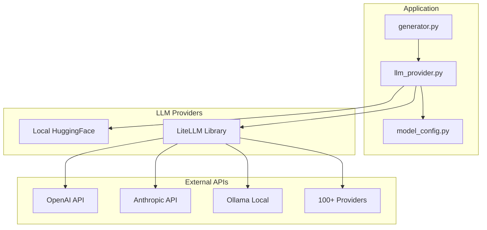
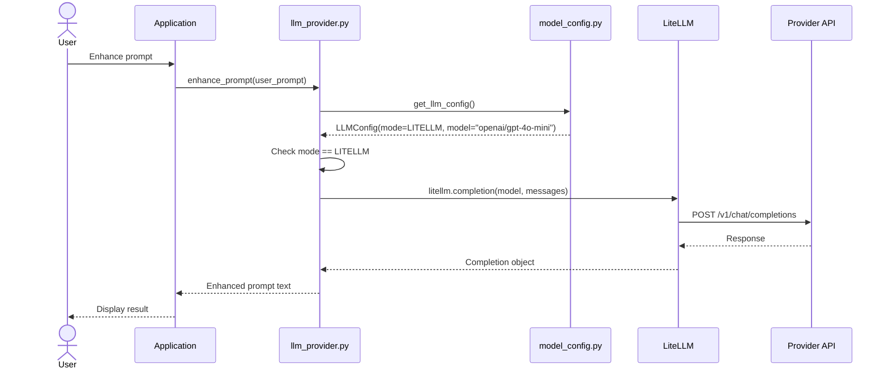

# Solution Design Document

## Validation Checklist

- [x] All required sections are complete
- [x] No [NEEDS CLARIFICATION] markers remain
- [x] All context sources are listed with relevance ratings
- [x] Project commands are discovered from actual project files
- [x] Constraints → Strategy → Design → Implementation path is logical
- [x] Architecture pattern is clearly stated with rationale
- [x] Every component in diagram has directory mapping
- [x] Every interface has specification
- [x] Error handling covers all error types
- [x] Quality requirements are specific and measurable
- [x] Every quality requirement has test coverage
- [x] **All architecture decisions confirmed by user**
- [x] Component names consistent across diagrams
- [x] A developer could implement from this design

---

## Constraints

CON-1 **No Custom API Key Variables**: LiteLLM reads standard provider env vars (OPENAI_API_KEY, ANTHROPIC_API_KEY). Z-Explorer must NOT define custom API key variables.

CON-2 **Same Interface**: All LLM functions (`generate_text`, `enhance_prompt`, `generate_prompt_variable_values`) must have identical signatures regardless of mode.

CON-3 **Backward Compatibility**: Existing `LLM_MODE` values (z_image, hf_local, hf_download, gguf) and `LLM_REPO` must continue working.

CON-4 **Zero VRAM for LiteLLM**: When in litellm mode, no local models should be loaded — all LLM inference happens via API.

## Implementation Context

### Required Context Sources

```yaml
# Existing codebase
- file: src/z_explorer/llm_provider.py
  relevance: HIGH
  sections: [_load_model, generate_text, enhance_prompt, generate_prompt_variable_values]
  why: "Core LLM module to be extended with LiteLLM support"

- file: src/z_explorer/model_config.py
  relevance: HIGH
  sections: [LLMMode enum, LLMConfig dataclass, get_llm_config]
  why: "Configuration management for LLM modes"

- file: src/z_explorer/setup_wizard.py
  relevance: MEDIUM
  why: "Setup wizard needs LiteLLM option"

# External documentation
- url: https://docs.litellm.ai/docs/
  relevance: HIGH
  sections: [completion, providers, environment_variables]
  why: "LiteLLM API and provider configuration"

- url: https://docs.litellm.ai/docs/providers
  relevance: HIGH
  why: "List of supported providers and their model formats"
```

### Implementation Boundaries

- **Must Preserve**: 
  - Existing LLM modes (z_image, hf_local, hf_download, gguf)
  - Current function signatures in llm_provider.py
  - Setup wizard flow and Settings UI structure
  
- **Can Modify**: 
  - `LLMMode` enum (add LITELLM)
  - `LLMConfig` dataclass (add model field)
  - `get_llm_config()` (read LLM_MODEL)
  - `llm_provider.py` (add litellm generation path)
  
- **Must Not Touch**: 
  - Image generation pipeline
  - Core generator logic
  - Variable substitution logic

### External Interfaces

#### LiteLLM API Interface

```yaml
# LiteLLM completion call
outbound:
  - name: "LiteLLM Completion"
    type: Python library call
    format: OpenAI-compatible
    authentication: Via provider env vars
    data_flow: "Prompt in, completion out"
    
# Example usage
litellm.completion(
    model="openai/gpt-4o-mini",
    messages=[{"role": "user", "content": prompt}],
    max_tokens=1024
)
```

### Project Commands

```bash
# Backend (Python)
Location: .

## Testing
Unit Tests: uv run pytest
Specific Test: uv run pytest tests/test_llm_provider.py -v

## Code Quality
Linting: uv run ruff check .
Formatting: uv run ruff format .

## Dependencies
Add LiteLLM: uv add litellm
```

## Solution Strategy

- **Architecture Pattern**: Strategy pattern for LLM providers. The existing `_load_model()` and `generate_text()` functions become a "local" strategy. A new "litellm" strategy handles cloud API calls. The public functions (`enhance_prompt`, `generate_prompt_variable_values`) remain unchanged.

- **Integration Approach**: 
  - Add `LITELLM` to `LLMMode` enum
  - Add `model` field to `LLMConfig` (replacing `hf_repo` conceptually but keeping both for compat)
  - In `generate_text()`, check mode and dispatch to local or litellm path
  - LiteLLM handles all provider-specific details

- **Justification**: Minimal changes to existing architecture. LiteLLM abstracts away provider differences, so we only need one integration point.

- **Key Decisions**:
  1. Rename `LLM_REPO` to `LLM_MODEL` (with backward compat)
  2. Use LiteLLM's standard model format: `provider/model-name`
  3. No custom API key env vars — use provider standards
  4. Same prompts work for both local and cloud (no mode-specific prompting)

## Building Block View

### Components



### Directory Map

```
src/z_explorer/
├── model_config.py           # MODIFY: Add LITELLM mode, LLM_MODEL support
├── llm_provider.py           # MODIFY: Add _generate_litellm() function
├── setup_wizard.py           # MODIFY: Add LiteLLM option in wizard
├── server.py                 # MINOR: Settings API may need model field
pyproject.toml                # MODIFY: Add litellm dependency
```

### Interface Specifications

#### Configuration Changes

```yaml
# New environment variable
LLM_MODEL: string
  description: "Model identifier in provider/model-name format"
  examples:
    - "openai/gpt-4o-mini"
    - "anthropic/claude-3-haiku-20240307"
    - "ollama/llama3"
  required_when: LLM_MODE=litellm

# Renamed (backward compat)
LLM_REPO → LLM_MODEL
  behavior: If LLM_REPO set but not LLM_MODEL, use LLM_REPO with deprecation warning

# Provider API keys (standard, not Z-Explorer specific)
OPENAI_API_KEY: For OpenAI models
ANTHROPIC_API_KEY: For Anthropic models
# etc. - see LiteLLM docs for each provider
```

#### Application Data Models

```python
# Extended LLMMode enum
class LLMMode(str, Enum):
    Z_IMAGE = "z_image"
    HF_LOCAL = "hf_local"
    HF_DOWNLOAD = "hf_download"
    GGUF = "gguf"
    LITELLM = "litellm"  # NEW

# Extended LLMConfig
@dataclass
class LLMConfig:
    mode: LLMMode
    
    # For HF modes
    hf_repo: str = DEFAULT_LLM_REPO
    hf_local_path: Optional[str] = None
    
    # For GGUF mode
    gguf_path: Optional[str] = None
    gguf_file: Optional[str] = None
    
    # NEW: For LITELLM mode (also works as unified model ID)
    model: Optional[str] = None  # e.g., "openai/gpt-4o-mini"
```

## Runtime View

### Primary Flow: LiteLLM Text Generation



### Mode Selection Logic

```python
def generate_text(prompt: str, max_tokens: int = 1024, ...) -> str:
    config = get_llm_config()
    
    if config.mode == LLMMode.LITELLM:
        # Cloud API path - no local model needed
        return _generate_litellm(prompt, config.model, max_tokens)
    else:
        # Local model path (existing logic)
        model, tokenizer = _load_model()
        return _generate_local(model, tokenizer, prompt, max_tokens)
```

### Error Handling

| Error Type | Handling |
|------------|----------|
| Missing API key | `LiteLLMAuthenticationError` → "Set {PROVIDER}_API_KEY environment variable" |
| Invalid model | `litellm.NotFoundError` → "Model '{model}' not found. Check model name format: provider/model-name" |
| Rate limit | `litellm.RateLimitError` → "Rate limit exceeded. Wait and retry, or switch to different model." |
| Network error | `ConnectionError` → "Cannot reach API. Check internet connection or use local mode." |
| API error | `litellm.APIError` → Propagate error message with context |

## Deployment View

**No deployment changes required.** 

- New dependency: `litellm` added to pyproject.toml
- No new services or infrastructure
- Configuration via existing .env mechanism

## Cross-Cutting Concepts

### Pattern Documentation

```yaml
# Pattern: Provider abstraction via LiteLLM
- pattern: Strategy pattern for LLM providers
  relevance: HIGH
  why: "Same interface, different backends (local vs cloud)"

# Pattern: Environment-based configuration
- pattern: Provider auth via standard env vars
  relevance: HIGH
  why: "Users set OPENAI_API_KEY etc., LiteLLM reads them automatically"
```

### LiteLLM Generation Pattern

```python
def _generate_litellm(
    prompt: str,
    model: str,
    max_tokens: int = 1024,
    temperature: float = 0.7,
) -> str:
    """Generate text using LiteLLM (cloud APIs).
    
    Args:
        prompt: The user prompt
        model: Model identifier (e.g., "openai/gpt-4o-mini")
        max_tokens: Maximum tokens to generate
        temperature: Sampling temperature
    
    Returns:
        Generated text response
    """
    import litellm
    
    response = litellm.completion(
        model=model,
        messages=[{"role": "user", "content": prompt}],
        max_tokens=max_tokens,
        temperature=temperature,
    )
    
    return response.choices[0].message.content.strip()
```

### Configuration Reading Pattern

```python
def get_llm_config() -> LLMConfig:
    """Get LLM configuration from environment.
    
    Supports both old (LLM_REPO) and new (LLM_MODEL) variable names.
    """
    mode_str = os.getenv("LLM_MODE", "").lower()
    
    # Read model with fallback to LLM_REPO for backward compat
    model = os.getenv("LLM_MODEL")
    if not model:
        repo = os.getenv("LLM_REPO")
        if repo:
            warnings.warn(
                "LLM_REPO is deprecated, use LLM_MODEL instead",
                DeprecationWarning
            )
            model = repo
    
    # Parse mode, including new LITELLM option
    try:
        mode = LLMMode(mode_str)
    except ValueError:
        mode = LLMMode.Z_IMAGE  # Default
    
    return LLMConfig(
        mode=mode,
        model=model,
        hf_repo=model if mode in (LLMMode.HF_DOWNLOAD,) else DEFAULT_LLM_REPO,
        # ... rest of config
    )
```

## Architecture Decisions

- [x] **ADR-1: Use LiteLLM Library**
  - Choice: Integrate LiteLLM as the abstraction layer for cloud LLM providers
  - Alternatives considered: Direct OpenAI SDK, manual multi-provider implementation
  - Rationale: LiteLLM supports 100+ providers with unified interface, actively maintained, OpenAI-compatible API
  - Trade-offs: Additional dependency (~10MB), tied to LiteLLM's release cycle
  - User confirmed: ✅

- [x] **ADR-2: Rename LLM_REPO to LLM_MODEL**
  - Choice: Use `LLM_MODEL` as the canonical variable name, keep `LLM_REPO` for backward compat
  - Alternatives considered: Keep LLM_REPO, use LLM_NAME
  - Rationale: "Model" is more accurate — it's a model identifier, not always a repository
  - Trade-offs: Requires deprecation warning and documentation update
  - User confirmed: ✅

- [x] **ADR-3: No Custom API Key Variables**
  - Choice: Users set provider's standard env vars (OPENAI_API_KEY, etc.)
  - Alternatives considered: Z_EXPLORER_API_KEY or Z_LLM_API_KEY
  - Rationale: Less configuration, works with existing provider setups, LiteLLM reads these automatically
  - Trade-offs: Less control, relies on LiteLLM's env var handling
  - User confirmed: ✅

- [x] **ADR-4: Same Prompts for All Modes**
  - Choice: Use identical prompts for local and cloud models
  - Alternatives considered: Mode-specific prompt templates
  - Rationale: Simplicity, consistent behavior, most models handle same prompts well
  - Trade-offs: May not fully optimize for each model's strengths
  - User confirmed: ✅

## Quality Requirements

| Requirement | Target | Measurement |
|-------------|--------|-------------|
| API response time | <5s for typical prompts | LiteLLM call duration |
| Error messages | Clear, actionable | Include provider name and fix instructions |
| Memory usage | 0 MB additional when in litellm mode | No local model loaded |
| Backward compat | 100% | All existing configs still work |

## Risks and Technical Debt

### Known Technical Issues

- LiteLLM is an additional dependency with its own transitive dependencies
- Different providers have different rate limits and pricing (user responsibility)

### Implementation Gotchas

- **Import litellm lazily**: Only import when `LLM_MODE=litellm` to avoid loading if not needed
- **Model format validation**: Validate `provider/model-name` format early with clear error
- **Token counting**: LiteLLM response includes usage info — expose if needed for cost tracking
- **Timeout handling**: LiteLLM has default timeouts; may need adjustment for slow models

## Test Specifications

### Critical Test Scenarios

**Scenario 1: LiteLLM Mode Generation**
```gherkin
Given: LLM_MODE=litellm and LLM_MODEL=openai/gpt-4o-mini
And: OPENAI_API_KEY is set
When: User calls enhance_prompt("a cat")
Then: LiteLLM is called with correct model
And: Response is returned as string
And: No local model is loaded
```

**Scenario 2: Backward Compatibility with LLM_REPO**
```gherkin
Given: LLM_MODE=hf_download and LLM_REPO=Qwen/Qwen3-4B
When: get_llm_config() is called
Then: Config has mode=HF_DOWNLOAD
And: Deprecation warning is logged
And: hf_repo is set to Qwen/Qwen3-4B
```

**Scenario 3: Missing API Key Error**
```gherkin
Given: LLM_MODE=litellm and LLM_MODEL=openai/gpt-4o-mini
And: OPENAI_API_KEY is NOT set
When: User calls generate_text("test")
Then: Clear error message: "Set OPENAI_API_KEY environment variable"
```

**Scenario 4: Invalid Model Format**
```gherkin
Given: LLM_MODE=litellm and LLM_MODEL=gpt-4 (missing provider prefix)
When: get_llm_config() validates
Then: Warning about model format
Or: LiteLLM handles gracefully with clear error
```

### Test Coverage Requirements

- **Configuration**: Mode parsing, LLM_MODEL/LLM_REPO handling, validation
- **Generation**: LiteLLM path, local path, error handling
- **Integration**: End-to-end with mock LiteLLM responses

---

## Glossary

### Domain Terms

| Term | Definition | Context |
|------|------------|---------|
| Provider | External LLM API service (OpenAI, Anthropic, etc.) | LiteLLM routes to correct provider |
| Model ID | Identifier in `provider/model-name` format | e.g., `openai/gpt-4o-mini` |

### Technical Terms

| Term | Definition | Context |
|------|------------|---------|
| LiteLLM | Python library for unified LLM API access | Our abstraction layer for cloud LLMs |
| Completion | LLM API call that generates text from prompt | Standard OpenAI terminology |
| VRAM | Video RAM on GPU | Local models use VRAM; litellm uses 0 |
