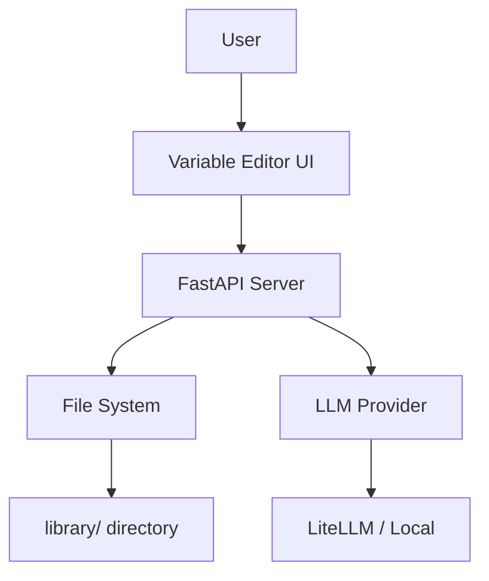
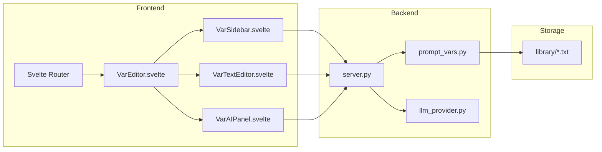
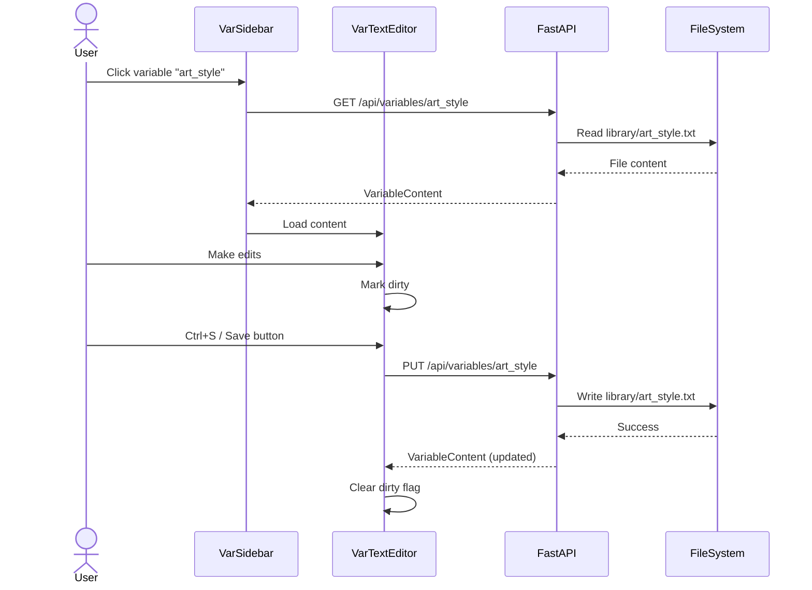
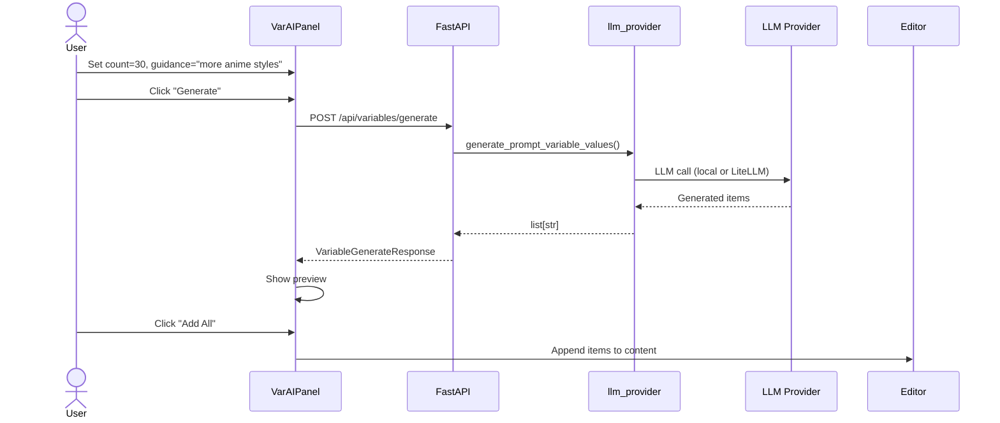

# Solution Design Document

## Validation Checklist

- [x] All required sections are complete
- [x] No [NEEDS CLARIFICATION] markers remain
- [x] All context sources are listed with relevance ratings
- [x] Project commands are discovered from actual project files
- [x] Constraints → Strategy → Design → Implementation path is logical
- [x] Architecture pattern is clearly stated with rationale
- [x] Every component in diagram has directory mapping
- [x] Every interface has specification
- [x] Error handling covers all error types
- [x] Quality requirements are specific and measurable
- [x] Every quality requirement has test coverage
- [x] **All architecture decisions confirmed by user**
- [x] Component names consistent across diagrams
- [x] A developer could implement from this design

---

## Constraints

CON-1 **Same LLM Configuration**: Variable Editor uses the app's `LLM_MODE` + `LLM_MODEL` from spec 004. No separate model configuration.

CON-2 **File Storage**: Variables stored as `.txt`/`.md` files in `library/` directory. No database.

CON-3 **SPA Routing**: Must integrate with existing Svelte app as a route (`/var-editor`), not a separate application.

CON-4 **Comment Format**: Comments use `#` prefix, consistent with existing `prompt_vars.py` parsing.

## Implementation Context

### Required Context Sources

```yaml
# Existing codebase
- file: src/z_explorer/models/prompt_vars.py
  relevance: HIGH
  sections: [PromptVars model, load_prompt_vars, save_prompt_var]
  why: "Existing variable loading/saving logic to extend"

- file: src/z_explorer/server.py
  relevance: HIGH
  sections: [/api/variables endpoint, VariableInfo model]
  why: "Existing API to extend with CRUD operations"

- file: src/z_explorer/llm_provider.py
  relevance: HIGH
  sections: [generate_prompt_variable_values]
  why: "Existing AI generation function to use"

- file: src/z_explorer/gui/src/App.svelte
  relevance: MEDIUM
  why: "Routing integration point"

# Design reference
- file: docs/specs/concepts/info-flyout/mockup-variable-editor.html
  relevance: HIGH
  why: "Visual mockup for UI implementation"

# Dependency specs
- doc: docs/specs/004-litellm-integration/
  relevance: HIGH
  why: "LLM configuration that Variable Editor will use"
```

### Implementation Boundaries

- **Must Preserve**: 
  - Existing `load_prompt_vars()` and variable format
  - Current `/api/variables` endpoint behavior
  - `library/` directory structure including subdirectories
  
- **Can Modify**: 
  - Add new API endpoints for CRUD
  - Add new Svelte route/components
  - Extend `VariableInfo` model
  
- **Must Not Touch**: 
  - Main app generation flow
  - Image generation pipeline
  - Core prompt parsing logic

### External Interfaces

#### System Context Diagram



### Project Commands

```bash
# Backend (Python)
Location: .
Unit Tests: uv run pytest
Linting: uv run ruff check .
Formatting: uv run ruff format .

# Frontend (Svelte)
Location: src/z_explorer/gui/
Dev Server: npm run dev
Build: npm run build
Type Check: npm run check
Tests: npm run test
```

## Solution Strategy

- **Architecture Pattern**: Sub-application within existing SPA. Variable Editor is a Svelte route (`/var-editor`) with three-panel layout. Backend provides REST API for CRUD operations and AI generation.

- **Integration Approach**: 
  - Frontend: New route in Svelte with dedicated components
  - Backend: Extend existing `/api/variables` with PUT, POST, DELETE, plus new `/api/variables/generate`
  - LLM: Reuse existing `generate_prompt_variable_values()` from `llm_provider.py`

- **Justification**: Leverages existing infrastructure. Variables are already file-based; we're just adding a UI layer and AI integration.

- **Key Decisions**:
  1. Three-panel layout (sidebar, editor, AI panel)
  2. Route-based navigation (`/var-editor`)
  3. Existing `generate_prompt_variable_values()` for AI
  4. File-based storage (no database)

## Building Block View

### Components



### Directory Map

**Frontend Components**:
```
src/z_explorer/gui/src/
├── App.svelte                      # MODIFY: Add route for /var-editor
├── lib/
│   ├── var-editor/                 # NEW: Variable Editor sub-app
│   │   ├── VarEditor.svelte        # NEW: Main container
│   │   ├── VarSidebar.svelte       # NEW: Variable list sidebar
│   │   ├── VarTextEditor.svelte    # NEW: Text editor panel
│   │   └── VarAIPanel.svelte       # NEW: AI generation panel
```

**Backend Modules**:
```
src/z_explorer/
├── server.py                       # MODIFY: Add CRUD endpoints
├── models/
│   └── prompt_vars.py              # MODIFY: Add update/delete functions
```

### Interface Specifications

#### New API Endpoints

```yaml
# Get single variable content
Endpoint: GET /api/variables/{name}
Response:
  success: boolean
  name: string
  content: string           # Raw file content
  item_count: number
  file_path: string
  error: string (optional)

# Update/Save variable
Endpoint: PUT /api/variables/{name}
Request:
  content: string           # Full file content to save
Response:
  success: boolean
  name: string
  item_count: number
  error: string (optional)

# Create new variable
Endpoint: POST /api/variables
Request:
  name: string              # Variable name (without extension)
  content: string           # Initial content (optional)
Response:
  success: boolean
  name: string
  file_path: string
  error: string (optional)

# Delete variable
Endpoint: DELETE /api/variables/{name}
Response:
  success: boolean
  error: string (optional)

# Generate new items with AI
Endpoint: POST /api/variables/generate
Request:
  variable_name: string     # Name for context
  current_content: string   # Existing file content (with comments)
  count: number             # Items to generate (default 20)
  guidance: string          # Optional user guidance
Response:
  success: boolean
  generated: list[string]   # Generated items
  error: string (optional)
```

#### Application Data Models

```python
# Extended response model for single variable
class VariableContent(BaseModel):
    success: bool
    name: str
    content: str              # Raw file content
    item_count: int
    file_path: str
    error: Optional[str] = None

# Request model for update
class VariableUpdateRequest(BaseModel):
    content: str

# Request model for create
class VariableCreateRequest(BaseModel):
    name: str
    content: str = ""

# Request model for AI generation
class VariableGenerateRequest(BaseModel):
    variable_name: str
    current_content: str
    count: int = 20
    guidance: str = ""

# Response model for AI generation
class VariableGenerateResponse(BaseModel):
    success: bool
    generated: list[str] = []
    error: Optional[str] = None
```

```typescript
// Frontend interfaces
interface VariableInfo {
  id: string;
  name: string;
  itemCount: number;
  description?: string;
}

interface EditorState {
  selectedVariable: string | null;
  content: string;
  isDirty: boolean;
  isLoading: boolean;
}

interface AIGenerationState {
  isGenerating: boolean;
  previewItems: string[];
  count: number;
  guidance: string;
}
```

## Runtime View

### Primary Flow: Edit and Save Variable



### Secondary Flow: AI Generation



### Error Handling

| Error Type | Handling |
|------------|----------|
| File not found | Return 404 with clear message |
| File write permission denied | Return 500 with file path info |
| Invalid variable name | Return 400 with validation message |
| LLM not configured | Return 400 with link to settings |
| LLM generation failed | Return error with retry suggestion |
| Encoding error | Try UTF-8, then Latin-1, then fail with message |

## Deployment View

**No deployment changes required.**

- New Svelte route bundled with existing build
- New API endpoints in existing FastAPI server
- No new services or infrastructure
- Files stored in existing `library/` directory

## Cross-Cutting Concepts

### Pattern Documentation

```yaml
# Routing pattern
- pattern: Hash-based or history routing in Svelte
  relevance: HIGH
  why: "Need to switch between main app and variable editor"

# Three-panel layout pattern
- pattern: Sidebar + Content + Inspector layout
  relevance: HIGH
  why: "Standard pattern for editors (VS Code, Obsidian)"

# Optimistic UI pattern
- pattern: Show changes immediately, sync in background
  relevance: MEDIUM
  why: "Better UX for save operations"
```

### VarEditor Component Pattern

```svelte
<!-- VarEditor.svelte structure -->
<script lang="ts">
  import VarSidebar from './VarSidebar.svelte';
  import VarTextEditor from './VarTextEditor.svelte';
  import VarAIPanel from './VarAIPanel.svelte';
  
  let selectedVariable: string | null = null;
  let content: string = '';
  let isDirty: boolean = false;
  
  function handleSelect(name: string) {
    // Load variable content
  }
  
  function handleSave() {
    // Save to backend
  }
  
  function handleGenerated(items: string[]) {
    // Append to content
    content = content + '\n' + items.join('\n');
    isDirty = true;
  }
</script>

<div class="var-editor">
  <VarSidebar 
    {selectedVariable} 
    on:select={(e) => handleSelect(e.detail)} 
  />
  
  <VarTextEditor 
    bind:content 
    bind:isDirty
    on:save={handleSave}
  />
  
  <VarAIPanel
    variableName={selectedVariable}
    {content}
    on:generated={(e) => handleGenerated(e.detail)}
  />
</div>
```

### API Implementation Pattern

```python
@app.get("/api/variables/{name}")
async def get_variable(name: str):
    """Get contents of a specific variable file."""
    prompt_vars = load_prompt_vars()
    var_id = f"__{name}__"
    
    if var_id not in prompt_vars:
        raise HTTPException(404, f"Variable '{name}' not found")
    
    var = prompt_vars[var_id]
    content = Path(var.file_path).read_text(encoding='utf-8')
    
    return VariableContent(
        success=True,
        name=name,
        content=content,
        item_count=len(var.values),
        file_path=var.file_path
    )

@app.put("/api/variables/{name}")
async def update_variable(name: str, request: VariableUpdateRequest):
    """Update/save a variable file."""
    prompt_vars_dir = get_prompt_vars_dir()
    file_path = Path(prompt_vars_dir) / f"{name}.txt"
    
    if not file_path.exists():
        # Try .md extension
        file_path = Path(prompt_vars_dir) / f"{name}.md"
    
    if not file_path.exists():
        raise HTTPException(404, f"Variable '{name}' not found")
    
    file_path.write_text(request.content, encoding='utf-8')
    
    # Reload to get updated count
    prompt_vars = load_prompt_vars()
    var_id = f"__{name}__"
    item_count = len(prompt_vars[var_id].values) if var_id in prompt_vars else 0
    
    return VariableContent(
        success=True,
        name=name,
        content=request.content,
        item_count=item_count,
        file_path=str(file_path)
    )

@app.post("/api/variables/generate")
async def generate_variable_items(request: VariableGenerateRequest):
    """Generate new items using AI."""
    from z_explorer.llm_provider import generate_prompt_variable_values
    
    try:
        # Use existing function with content as context
        generated = generate_prompt_variable_values(
            variable_name=request.variable_name,
            context_prompt=request.current_content,  # Includes comments!
            count=request.count
        )
        
        # Filter out duplicates
        existing = set(line.strip() for line in request.current_content.split('\n')
                      if line.strip() and not line.strip().startswith('#'))
        unique = [item for item in generated if item.strip() not in existing]
        
        return VariableGenerateResponse(success=True, generated=unique)
    except Exception as e:
        return VariableGenerateResponse(success=False, error=str(e))
```

## Architecture Decisions

- [x] **ADR-1: Three-Panel Layout**
  - Choice: Sidebar (variable list) + Editor (text) + AI Panel (generation)
  - Alternatives considered: Two-panel, modal-based, full-page editor
  - Rationale: Matches mockup design, provides context in all panels simultaneously
  - Trade-offs: Requires more screen space
  - User confirmed: ✅

- [x] **ADR-2: Route-Based Navigation**
  - Choice: `/var-editor` as Svelte route within SPA
  - Alternatives considered: Modal overlay, separate app, iframe
  - Rationale: Clean URL, shareable link, proper browser back button behavior
  - Trade-offs: Slightly more complex routing
  - User confirmed: ✅

- [x] **ADR-3: Reuse generate_prompt_variable_values()**
  - Choice: Use existing LLM function from llm_provider.py
  - Alternatives considered: New dedicated function, direct LiteLLM call
  - Rationale: Already handles both local and cloud modes, tested, consistent
  - Trade-offs: May need to adapt prompt template slightly
  - User confirmed: ✅

- [x] **ADR-4: File-Based Storage (No Database)**
  - Choice: Continue using `.txt`/`.md` files in `library/`
  - Alternatives considered: SQLite, JSON store
  - Rationale: Existing system works, files are human-readable, git-friendly
  - Trade-offs: No transactions, limited query capability
  - User confirmed: ✅

## Quality Requirements

| Requirement | Target | Measurement |
|-------------|--------|-------------|
| Editor response | <100ms for typing | Input latency |
| File load time | <500ms for files <1000 lines | API response time |
| AI generation | <10s for 20 items | Including network |
| Save operation | <200ms | API response time |
| Route navigation | <300ms | Time to render |

## Risks and Technical Debt

### Known Technical Issues

- Existing `generate_prompt_variable_values()` may need prompt adjustment for comment awareness
- Large variable files (>1000 lines) may slow editor

### Implementation Gotchas

- **File encoding**: Always use UTF-8 with fallback to Latin-1
- **Variable name validation**: Reject names with special characters (`/`, `\`, `..`)
- **Concurrent edits**: No locking — last write wins
- **Subdirectory handling**: Preserve existing `library/subfolder/` structure in UI

## Test Specifications

### Critical Test Scenarios

**Scenario 1: Load and Edit Variable**
```gherkin
Given: Variable "art_style" exists with 10 items
When: User navigates to /var-editor and selects "art_style"
Then: Content loads in editor
And: User can edit and save
And: Changes persist in file
```

**Scenario 2: AI Generation**
```gherkin
Given: Variable "color" is selected with content "red\nblue\ngreen"
When: User sets count=5 and clicks Generate
Then: AI returns 5 new colors
And: Preview shows generated items
And: "Add All" appends to editor
```

**Scenario 3: Create New Variable**
```gherkin
Given: User is on /var-editor
When: User clicks "New Variable" and enters "weather"
Then: File library/weather.txt is created
And: Variable appears in sidebar
And: Editor is ready for input
```

**Scenario 4: Handle Missing LLM**
```gherkin
Given: LLM is not configured (LLM_MODE not set)
When: User clicks Generate
Then: Error message shown with helpful guidance
And: No crash or hang
```

### Test Coverage Requirements

- **API endpoints**: All CRUD operations
- **File operations**: Read, write, create, delete with various encodings
- **AI integration**: Mock LLM responses, error handling
- **UI components**: Sidebar interaction, editor shortcuts, AI panel

---

## Glossary

### Domain Terms

| Term | Definition | Context |
|------|------------|---------|
| Variable | A placeholder in prompts (`__animal__`) that gets substituted with values | Core Z-Explorer concept |
| Variable File | Text file in `library/` containing one value per line | Storage format |
| Comment | Line starting with `#`, used for organization and AI context | File syntax |

### Technical Terms

| Term | Definition | Context |
|------|------------|---------|
| Three-Panel Layout | UI pattern with sidebar, main content, and inspector | Editor design |
| Dirty State | Unsaved changes exist in editor | UX indicator |
| SPA Routing | Navigation within single-page app without page reload | Svelte navigation |
