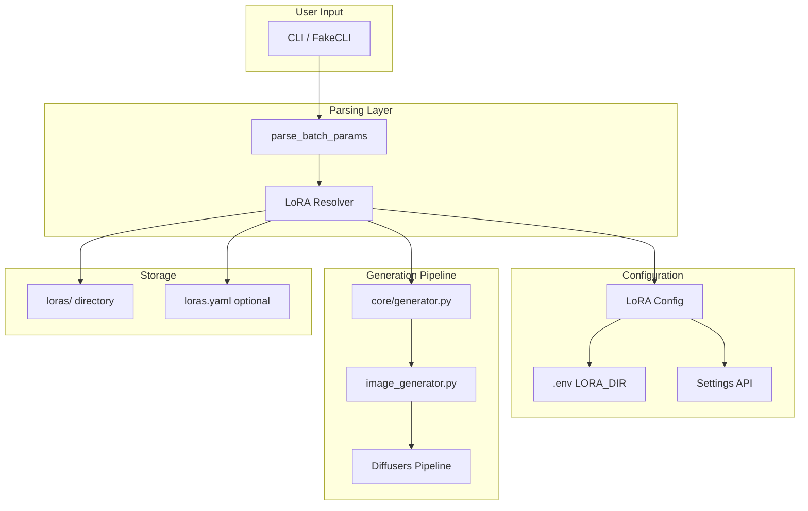
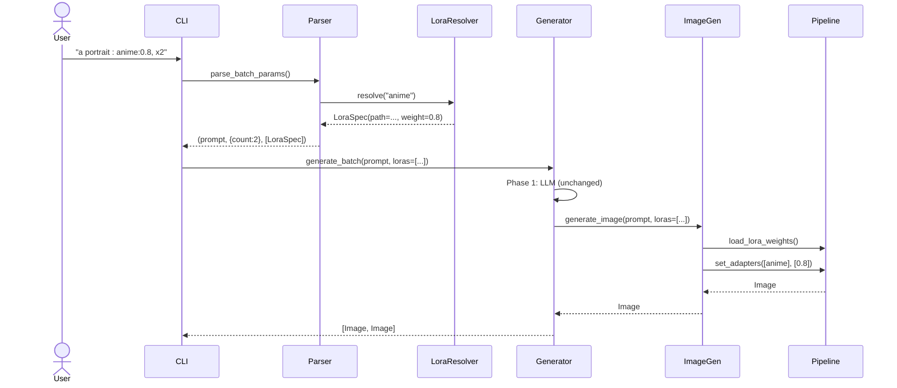

# Solution Design Document

## Validation Checklist

- [x] All required sections are complete
- [x] No [NEEDS CLARIFICATION] markers remain
- [x] All context sources are listed with relevance ratings
- [x] Project commands are discovered from actual project files
- [x] Constraints → Strategy → Design → Implementation path is logical
- [x] Architecture pattern is clearly stated with rationale
- [x] Every component in diagram has directory mapping
- [x] Every interface has specification
- [x] Error handling covers all error types
- [x] Quality requirements are specific and measurable
- [x] Every quality requirement has test coverage
- [x] **All architecture decisions confirmed by user**
- [x] Component names consistent across diagrams
- [x] A developer could implement from this design

---

## Constraints

CON-1: **Framework**: Python 3.12+, diffusers library, peft library for LoRA loading
CON-2: **Performance**: LoRA loading must not significantly impact generation time (<500ms overhead)
CON-3: **Memory**: Must work within existing VRAM budget; LoRAs are small (2-200MB) relative to base model
CON-4: **Compatibility**: Only `.safetensors` format; must work with Z-Image-Turbo base model
CON-5: **Platform**: Windows, macOS, Linux (same as existing features)

## Implementation Context

### Required Context Sources

- ICO-1: Core generation architecture
  ```yaml
  - file: src/z_explorer/core/generator.py
    relevance: HIGH
    sections: [generate_batch, _emit, Phase 1/2 pattern]
    why: "Central generation workflow where LoRA integration happens"

  - file: src/z_explorer/image_generator.py
    relevance: HIGH
    sections: [_load_pipeline, generate_image, unload_pipeline]
    why: "Pipeline loading and generation where LoRA weights applied"

  - file: src/z_explorer/cli.py
    relevance: HIGH
    sections: [parse_batch_params, interactive loop]
    why: "Batch parameter parsing where LoRA syntax added"
  ```

- ICO-2: Configuration patterns
  ```yaml
  - file: src/z_explorer/model_config.py
    relevance: HIGH
    why: "Pattern for environment variable configuration"

  - file: src/z_explorer/server.py
    relevance: MEDIUM
    sections: [/api/settings/models endpoint]
    why: "Settings API pattern for session overrides"
  ```

- ICO-3: GUI patterns
  ```yaml
  - file: src/z_explorer/gui/src/lib/components/Settings.svelte
    relevance: MEDIUM
    why: "Settings dialog pattern for GUI integration"

  - file: src/z_explorer/gui/src/lib/components/FakeCLI.svelte
    relevance: MEDIUM
    why: "Autocomplete pattern for LoRA suggestions"
  ```

### Implementation Boundaries

- **Must Preserve**: 
  - Two-phase generation pattern (LLM then Image)
  - Existing batch parameter syntax (`x4`, `w1024`, `h768`)
  - Progress event pattern and percentages
  - Memory management (unload LLM before loading image pipeline)
  
- **Can Modify**: 
  - `parse_batch_params()` to recognize LoRA params
  - `generate_image()` signature to accept LoRA config
  - Settings dialog to add LoRA directory field
  
- **Must Not Touch**: 
  - LLM provider code (Phase 1)
  - Variable substitution logic
  - Prompt enhancement logic

### Project Commands

```bash
# Development
Install Dependencies: uv sync
Start Development (Web): uv run z-explorer
Start Development (CLI): uv run z-explorer --cli

# Testing
Unit Tests: uv run pytest
Specific Test: uv run pytest tests/test_file.py -v
Coverage: uv run pytest --cov

# Code Quality
Linting: uv run ruff check .
Formatting: uv run ruff format .

# GUI Development
Location: src/z_explorer/gui/
Install: npm install
Dev Server: npm run dev
Build: npm run build
Type Check: npm run check
```

## Solution Strategy

- **Architecture Pattern**: Extension of existing modular pipeline architecture
- **Integration Approach**: 
  - LoRA parsing integrated into existing batch parameter parser
  - LoRA loading integrated into Phase 2 (image generation) of two-phase workflow
  - Configuration follows existing env var + settings API + GUI pattern
- **Justification**: 
  - Reuses proven patterns (grammar as interface, lazy loading, progress events)
  - Minimal new concepts for users (same `: param` syntax)
  - No architectural changes required
- **Key Decisions**:
  - Scan LoRA directory at generation time (no restart needed)
  - Default weight 0.8 (community recommendation)
  - Up to 4 simultaneous LoRAs (stability limit)

## Building Block View

### Components



### Directory Map

```
src/z_explorer/
├── lora_config.py              # NEW: LoRA configuration and discovery
├── cli.py                      # MODIFY: parse_batch_params() for LoRA syntax
├── model_config.py             # MODIFY: Add LORA_DIR env var
├── core/
│   └── generator.py            # MODIFY: Pass LoRA config to image generation
├── image_generator.py          # MODIFY: Load/apply LoRA weights
└── server.py                   # MODIFY: Add lora_dir to settings API

src/z_explorer/gui/src/lib/
├── components/
│   ├── Settings.svelte         # MODIFY: Add LoRA directory field
│   └── FakeCLI.svelte          # MODIFY: Add LoRA autocomplete
└── stores/
    └── settings.ts             # MODIFY: Add lora_dir to settings store

loras/                          # NEW: Default LoRA directory (created if missing)
└── loras.yaml                  # NEW: Optional metadata file
```

### Interface Specifications

#### Data Models

```python
# NEW: src/z_explorer/lora_config.py

@dataclass
class LoraSpec:
    """Single LoRA specification parsed from prompt."""
    name: str                    # Identifier (filename without extension)
    weight: float = 0.8          # Weight 0.0-2.0
    path: Path | None = None     # Resolved file path (None if not found)

@dataclass  
class LoraConfig:
    """LoRA directory configuration."""
    lora_dir: Path = Path("./loras")
    
    def validate(self) -> tuple[bool, list[str]]:
        """Validate configuration."""
        errors = []
        if not self.lora_dir.exists():
            # Create directory if missing
            self.lora_dir.mkdir(parents=True, exist_ok=True)
        return (len(errors) == 0, errors)
    
    def discover_loras(self) -> list[str]:
        """Return list of available LoRA names."""
        if not self.lora_dir.exists():
            return []
        return [f.stem for f in self.lora_dir.glob("*.safetensors")]
    
    def resolve_lora(self, name: str) -> Path | None:
        """Resolve LoRA name to file path."""
        path = self.lora_dir / f"{name}.safetensors"
        return path if path.exists() else None
    
    def get_default_weight(self, name: str) -> float:
        """Get default weight from loras.yaml or return 0.8."""
        yaml_path = self.lora_dir / "loras.yaml"
        if yaml_path.exists():
            # Load and check for custom weight
            ...
        return 0.8
```

#### Parser Extension

```python
# MODIFY: src/z_explorer/cli.py

# Known batch parameter prefixes (ALWAYS take precedence over LoRAs)
BATCH_PARAM_PREFIXES = {'x', 'w', 'h', 'seed', 'steps'}

def parse_batch_params(user_input: str) -> tuple[str, dict, list[LoraSpec]]:
    """Parse prompt with batch params and LoRAs.
    
    Examples:
        "a cat : x4"                    → (prompt, {count:4}, [])
        "a cat : anime"                 → (prompt, {}, [LoraSpec(anime, 0.8)])
        "a cat : anime:0.7, x3"         → (prompt, {count:3}, [LoraSpec(anime, 0.7)])
        "a cat : anime, sketch:0.5"     → (prompt, {}, [LoraSpec(anime, 0.8), LoraSpec(sketch, 0.5)])
    
    Algorithm:
        1. Split input by last ':'
        2. For each comma-separated param:
           a. Check if starts with known batch prefix → batch param
           b. Else check if file exists in LORA_DIR → LoRA spec
           c. Else warn and skip
    """
    if ':' not in user_input:
        return (user_input.strip(), {}, [])
    
    # Split by LAST colon (prompt may contain colons)
    last_colon = user_input.rfind(':')
    prompt = user_input[:last_colon].strip()
    params_str = user_input[last_colon + 1:].strip()
    
    batch_params = {}
    lora_specs = []
    lora_config = get_lora_config()
    
    for param in params_str.split(','):
        param = param.strip()
        if not param:
            continue
        
        # Parse name:value format
        if ':' in param:
            name, value = param.split(':', 1)
            name = name.strip()
            value = value.strip()
        else:
            name = param
            value = None
        
        # Step 1: Check if known batch param prefix
        prefix = name.rstrip('0123456789')
        if prefix.lower() in BATCH_PARAM_PREFIXES:
            # Parse as batch param (x4, w1024, h768, seed:123)
            if prefix == 'x':
                batch_params['count'] = int(name[1:])
            elif prefix == 'w':
                batch_params['width'] = int(name[1:])
            elif prefix == 'h':
                batch_params['height'] = int(name[1:])
            elif name == 'seed':
                batch_params['seed'] = int(value)
            elif name == 'steps':
                batch_params['steps'] = int(value)
            continue
        
        # Step 2: Check if LoRA file exists
        lora_path = lora_config.resolve_lora(name)
        if lora_path:
            weight = float(value) if value else lora_config.get_default_weight(name)
            # Clamp weight to valid range
            if weight < 0:
                weight = 0.0
            elif weight > 2.0:
                weight = 2.0
            lora_specs.append(LoraSpec(name=name, weight=weight, path=lora_path))
        else:
            # Unknown param - will be warned during generation
            lora_specs.append(LoraSpec(name=name, weight=0.8, path=None))
    
    return (prompt, batch_params, lora_specs)
```

#### Image Generator Extension

```python
# MODIFY: src/z_explorer/image_generator.py

def generate_image(
    prompt: str,
    ...,
    loras: list[LoraSpec] | None = None,
) -> tuple[Image.Image, str]:
    """Generate image with optional LoRA support."""
    
    pipe = _load_pipeline()
    
    # Apply LoRAs if specified
    if loras:
        for lora in loras:
            if lora.path:
                pipe.load_lora_weights(
                    str(lora.path), 
                    adapter_name=lora.name
                )
        
        # Set all adapters with weights
        pipe.set_adapters(
            [l.name for l in loras if l.path],
            adapter_weights=[l.weight for l in loras if l.path]
        )
    
    # Generate image...
    result = pipe(prompt, ...)
    
    # Note: LoRAs stay loaded for efficiency
    # Unload happens when pipeline is unloaded
    
    return result
```

#### Settings API Extension

```python
# MODIFY: src/z_explorer/server.py

@dataclass
class ModelSettingsUpdate:
    # Existing fields...
    lora_dir: str | None = None

@app.post("/api/settings/models")
async def update_model_settings(settings: ModelSettingsUpdate):
    if settings.lora_dir:
        # Validate directory
        path = Path(settings.lora_dir)
        if not path.exists():
            path.mkdir(parents=True, exist_ok=True)
        # Store as session override
        set_override_config(lora_dir=str(path))
    return {"status": "ok"}

@app.get("/api/loras")
async def list_loras():
    """List available LoRAs."""
    config = get_lora_config()
    loras = config.discover_loras()
    return {
        "lora_dir": str(config.lora_dir),
        "loras": [
            {"name": name, "default_weight": config.get_default_weight(name)}
            for name in loras
        ]
    }
```

#### CLI /loras Command

```python
# MODIFY: src/z_explorer/cli.py - Add to command handlers

def handle_loras_command() -> None:
    """Handle /loras command - list available LoRAs."""
    config = get_lora_config()
    loras = config.discover_loras()
    
    console.print(f"\n📁 LoRA Directory: {config.lora_dir} ({len(loras)} files)\n")
    
    if not loras:
        console.print("  [dim]No LoRA files found. Drop .safetensors files in the directory.[/dim]")
        return
    
    for name in sorted(loras):
        weight = config.get_default_weight(name)
        console.print(f"  {name:<20} [dim](default: {weight})[/dim]")
    
    console.print()

# In interactive loop, add command handling:
if user_input.strip().lower() == "/loras":
    handle_loras_command()
    continue
```

#### YAML Metadata Loader

```python
# IN: src/z_explorer/lora_config.py

import yaml
from pathlib import Path
from functools import lru_cache

@lru_cache(maxsize=1)
def _load_loras_yaml(yaml_path: Path, mtime: float) -> dict:
    """Load and cache loras.yaml. Cache invalidated by mtime."""
    try:
        with open(yaml_path, 'r') as f:
            return yaml.safe_load(f) or {}
    except Exception:
        return {}

class LoraConfig:
    # ... existing methods ...
    
    def get_default_weight(self, name: str) -> float:
        """Get default weight from loras.yaml or return 0.8."""
        yaml_path = self.lora_dir / "loras.yaml"
        
        if not yaml_path.exists():
            return 0.8
        
        # Use mtime for cache invalidation
        mtime = yaml_path.stat().st_mtime
        metadata = _load_loras_yaml(yaml_path, mtime)
        
        if name in metadata and isinstance(metadata[name], dict):
            weight = metadata[name].get('weight', 0.8)
            # Validate weight range
            if isinstance(weight, (int, float)) and 0 <= weight <= 2:
                return float(weight)
        
        return 0.8
    
    def get_lora_description(self, name: str) -> str | None:
        """Get description from loras.yaml if available."""
        yaml_path = self.lora_dir / "loras.yaml"
        
        if not yaml_path.exists():
            return None
        
        mtime = yaml_path.stat().st_mtime
        metadata = _load_loras_yaml(yaml_path, mtime)
        
        if name in metadata and isinstance(metadata[name], dict):
            return metadata[name].get('description')
        
        return None
```

#### GUI Autocomplete Integration

```typescript
// MODIFY: src/z_explorer/gui/src/lib/components/FakeCLI.svelte

// Add to autocomplete logic
let availableLoras: string[] = [];

// Fetch available LoRAs on mount
onMount(async () => {
    const response = await fetch('/api/loras');
    const data = await response.json();
    availableLoras = data.loras.map(l => l.name);
});

// In autocomplete handler, after detecting ':' in input:
function getAutocompleteSuggestions(input: string): string[] {
    const colonIndex = input.lastIndexOf(':');
    if (colonIndex === -1) return [];
    
    const afterColon = input.slice(colonIndex + 1);
    const lastParam = afterColon.split(',').pop()?.trim() || '';
    
    // Filter LoRAs that match current input
    return availableLoras
        .filter(name => name.toLowerCase().startsWith(lastParam.toLowerCase()))
        .map(name => `${name}:0.8`);  // Suggest with default weight
}
```

## Runtime View

### Primary Flow: Generate Image with LoRA

1. User enters: `a portrait : anime:0.8, x2`
2. `parse_batch_params()` extracts:
   - prompt: "a portrait"
   - batch_params: {count: 2}
   - loras: [LoraSpec(name="anime", weight=0.8)]
3. LoRA resolver checks `loras/anime.safetensors` exists
4. Progress: "✨ Found LoRA: anime (weight: 0.8)"
5. Phase 1 (LLM): Variable substitution, prompt enhancement
6. Phase 2 (Image):
   - Load pipeline (if not cached)
   - Load LoRA weights: `pipe.load_lora_weights(...)`
   - Set adapters: `pipe.set_adapters(...)`
   - Generate 2 images (LoRAs stay loaded for entire batch)
7. Progress: Complete

### Progress Event Timing

```
Timeline for "a cat : anime:0.8, sketch:0.5, x3":

0%   ─── Start generation
2%   ─── "✨ Found LoRA: anime (weight: 0.8)"
3%   ─── "✨ Found LoRA: sketch (weight: 0.5)"
     ─── (If LoRA missing: "⚠️ LoRA not found: xyz")
     ─── (If weight clamped: "⚠️ Weight clamped: 2.5 → 2.0")
5%   ─── Phase 1: LLM processing starts
35%  ─── Phase 1 complete, unloading LLM
40%  ─── Phase 2: Loading image pipeline
42%  ─── "🎨 Loading LoRA adapters..."
     ─── (Load anime.safetensors)
     ─── (Load sketch.safetensors)
     ─── (If load fails: "⚠️ Failed to load LoRA: xyz - continuing without")
44%  ─── "🎨 Generating with 2 LoRAs..."
45%  ─── Image 1/3 generation starts
60%  ─── Image 1/3 complete
62%  ─── Image 2/3 generation starts
77%  ─── Image 2/3 complete
79%  ─── Image 3/3 generation starts
94%  ─── Image 3/3 complete
95%  ─── Saving images
100% ─── Complete
```

**Key behaviors:**
- LoRA validation happens ONCE at start (2-3%)
- LoRA loading happens ONCE before first image (42-44%)
- LoRAs stay loaded for entire batch (efficiency)
- If a LoRA fails to load, ALL images in batch proceed without it
- Warnings appear immediately when detected, not deferred



### Error Handling

| Error | Detection | Response |
|-------|-----------|----------|
| LoRA not found | `resolve_lora()` returns None | Warning in progress: "⚠️ LoRA not found: xyz"; continue without |
| Invalid weight | Weight < 0 or > 2 | Clamp to range; warning: "⚠️ Weight clamped: 2.5 → 2.0" |
| Corrupted LoRA file | Exception during `load_lora_weights()` | Warning: "⚠️ Failed to load LoRA: xyz"; continue without |
| LORA_DIR missing | `validate()` check | Create directory automatically |
| Incompatible LoRA | Exception during generation | Warning + skip; don't fail entire batch |

## Deployment View

**No change to deployment** - LoRA support is a runtime feature using existing infrastructure.

- **Environment**: Same as current (local machine)
- **Configuration**: New `LORA_DIR` env var (optional, has default)
- **Dependencies**: Add `peft` to pyproject.toml

## Cross-Cutting Concepts

### Pattern Documentation

```yaml
# Existing patterns used
- pattern: Lazy loading (image_generator.py)
  relevance: HIGH
  why: "LoRAs loaded on first use, cached for batch"

- pattern: Progress events (core/generator.py) 
  relevance: HIGH
  why: "LoRA status reported through same event stream"

- pattern: Batch parameter parsing (cli.py)
  relevance: HIGH
  why: "LoRA syntax integrated into existing parser"

- pattern: Config hierarchy (model_config.py)
  relevance: MEDIUM
  why: "LORA_DIR follows same .env → API → runtime pattern"
```

### Error Handling Pattern

```python
# Graceful degradation for LoRA errors
try:
    pipe.load_lora_weights(lora.path, adapter_name=lora.name)
except Exception as e:
    _emit(on_progress, "lora_error", f"⚠️ Failed to load LoRA: {lora.name}", ...)
    # Continue without this LoRA
    continue
```

## Architecture Decisions

- [x] **ADR-1: Reuse batch parameter syntax**
  - Rationale: Users already know `: x4, w1024`; adding LoRAs fits naturally
  - Trade-offs: Must disambiguate LoRAs from batch params (solved by checking LORA_DIR)
  - User confirmed: ✅ Yes (per concept document)

- [x] **ADR-2: Scan at generation time**
  - Rationale: No restart needed when adding new LoRAs
  - Trade-offs: Small overhead per generation (mitigated by caching)
  - User confirmed: ✅ Yes (per PRD)

- [x] **ADR-3: Default weight 0.8**
  - Rationale: Community recommendation; safe starting point
  - Trade-offs: May not be optimal for all LoRAs (users can override)
  - User confirmed: ✅ Yes (per concept document)

- [x] **ADR-4: Keep LoRAs loaded across batch**
  - Rationale: Efficiency - don't reload for each image in batch
  - Trade-offs: Memory stays allocated until pipeline unloaded
  - User confirmed: ✅ Yes (fits existing memory pattern)

## Quality Requirements

| Requirement | Target | Measurement |
|-------------|--------|-------------|
| LoRA load time | <500ms | Time from parse to ready |
| Generation overhead | <5% | Compare with/without LoRA |
| Discovery latency | <100ms | Time to list available LoRAs |
| Error recovery | 100% | Generation completes despite LoRA errors |

## Risks and Technical Debt

### Known Technical Issues
- None specific to LoRA (new feature)

### Implementation Gotchas
- **peft library required**: Must add to dependencies; provides `load_lora_weights()`
- **Weight range**: peft accepts 0-2+, but >1.5 often causes artifacts
- **Adapter naming**: Each LoRA needs unique `adapter_name`; use filename
- **Order matters**: LoRAs applied left-to-right; may affect output slightly

## Test Specifications

### Critical Test Scenarios

**Scenario 1: Single LoRA Application**
```gherkin
Given: LoRA file "anime.safetensors" exists in LORA_DIR
When: User generates with "a cat : anime"
Then: Progress shows "✨ Found LoRA: anime (weight: 0.8)"
And: Generated image reflects anime style
```

**Scenario 2: Multiple LoRAs with Weights**
```gherkin
Given: LoRA files "anime.safetensors" and "sketch.safetensors" exist
When: User generates with "a cat : anime:0.7, sketch:0.5"
Then: Both LoRAs loaded with correct weights
And: Generated image reflects both styles
```

**Scenario 3: LoRA Not Found**
```gherkin
Given: No "missing.safetensors" file exists
When: User generates with "a cat : missing"
Then: Warning shown "⚠️ LoRA not found: missing"
And: Generation continues without LoRA
And: Image generated successfully
```

**Scenario 4: Invalid Weight Clamping**
```gherkin
Given: LoRA file "anime.safetensors" exists
When: User generates with "a cat : anime:2.5"
Then: Warning shown "⚠️ Weight clamped: 2.5 → 2.0"
And: LoRA applied with weight 2.0
```

**Scenario 5: LoRA with Batch and Other Params**
```gherkin
Given: LoRA file "anime.safetensors" exists
When: User generates with "a cat : anime:0.8, x3, w1024"
Then: 3 images generated at 1024px width with anime LoRA
```

### Test Coverage Requirements

- **Parsing**: All syntax variants, edge cases (quoted names, special chars)
- **Discovery**: Empty dir, missing dir, with/without YAML
- **Loading**: Success, failure, multiple LoRAs
- **Generation**: With LoRAs, without LoRAs, mixed batch
- **Settings**: API override, GUI update, .env precedence

---

## Glossary

### Domain Terms

| Term | Definition | Context |
|------|------------|---------|
| LoRA | Low-Rank Adaptation - small adapter that modifies base model output | Applied during image generation |
| Weight | Strength of LoRA effect (0.0 = none, 1.0 = full, >1.0 = amplified) | User-specified per LoRA |
| Adapter | peft library term for a loaded LoRA | Internal implementation |

### Technical Terms

| Term | Definition | Context |
|------|------------|---------|
| safetensors | Secure tensor file format for model weights | Only supported LoRA format |
| peft | Python library for parameter-efficient fine-tuning | Provides LoRA loading APIs |
| batch params | Parameters after `:` in prompt syntax | Where LoRA syntax lives |
